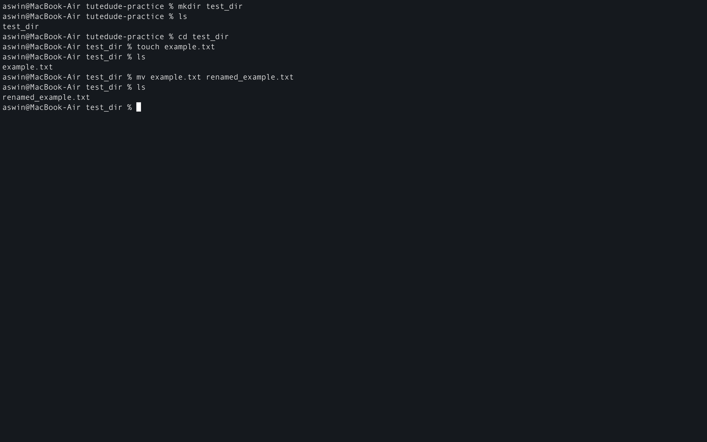
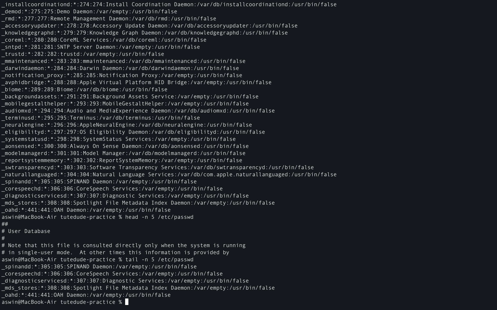
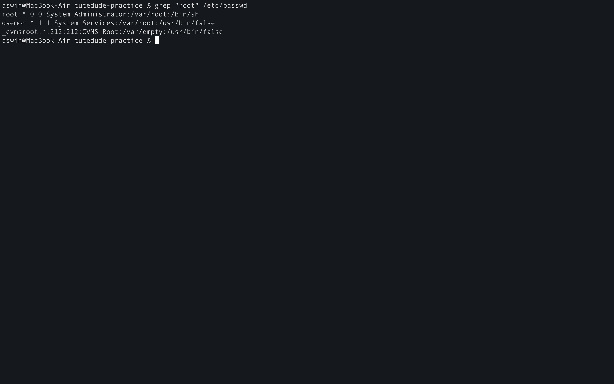
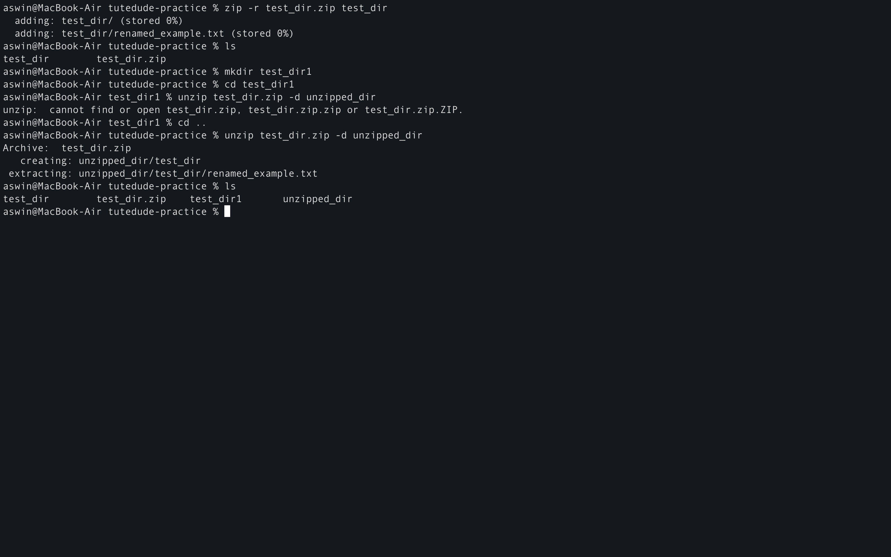
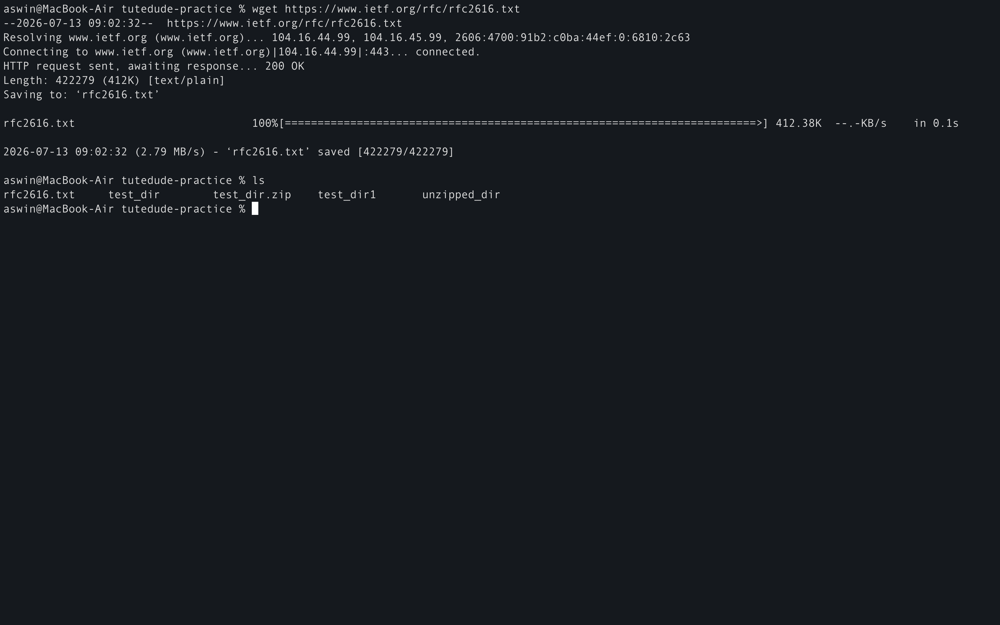
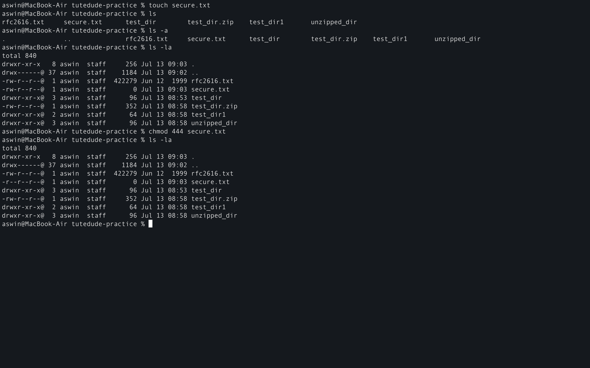
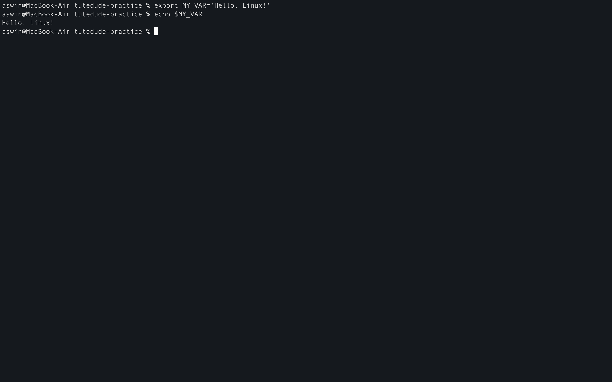

<div align="center">

# Assignment 1 : Linux Basics 

</div>

**Task 1 : Creating and renaming files/directories**
```
# 1. Create the directory
mkdir test_dir

# 2. Navigate into it and create the empty file
cd test_dir
touch example.txt

# 3. Rename the file
mv example.txt renamed_example.txt
```
**Explanation**
- mkdir test_dir: Creates a new folder named test_dir in your current working directory.

- touch example.txt: Creates a brand new, empty file named example.txt.

- mv example.txt renamed_example.txt: The mv (move) command is used here to rename the file within the same directory.



---

**Task 2 : Viewing File Contents**
```
# 1. View entire file
cat /etc/passwd

# 2. View first 5 lines
head -n 5 /etc/passwd

# 3. View last 5 lines
tail -n 5 /etc/passwd
```
**Explanation**
- cat /etc/passwd: Dumps the entire contents of the system's user account file (/etc/passwd) onto your terminal screen.

- head -n 5: Restricts the output to just the top (first) 5 lines of the specified file.

- tail -n 5: Restricts the output to just the bottom (last) 5 lines of the specified file.



---

**Task 3 : Searching for Patterns**
```
grep "root" /etc/passwd
```
**Explanation**
- grep "root": Scans the /etc/passwd file line by line and filters out only the lines that contain the exact string "root".



---

**Task 4 : Zipping and Unzipping**
```
# 1. Zip the directory (run this from the parent directory of test_dir)
zip -r test_dir.zip test_dir

# 2. Unzip into a specific new directory
unzip test_dir.zip -d unzipped_dir
```
**Explanation**
- zip -r: The -r flag stands for "recursive", which ensures that all files and subfolders inside test_dir are included in the test_dir.zip archive.

- unzip -d unzipped_dir: Extracts the contents of the zip file and uses the -d flag to automatically create and target a new directory called unzipped_dir.



---

**Task 5 : Downloading Files**
```
wget https://www.ietf.org/rfc/rfc2616.txt
```
**Explanation**
- wget: A non-interactive network downloader. It reaches out to the provided URL, fetches the file (sample.txt), and saves it directly into your current working directory.



---

**Task 6 : Changing Permissions**
```
# 1. Create the file
touch secure.txt

# 2. Change permissions to read-only for everyone
chmod 444 secure.txt
```
**Explanation**
- chmod 444: Changes the file permissions using absolute octal notation. 4 represents read-only permission. Setting it to 444 applies read-only rights to the Owner, the Group, and Others (everyone).



---

**Task 7 : Working with Environment Variables**
```
# 1. Export the variable
export MY_VAR='Hello, Linux!'

# 2. Verify it worked
echo $MY_VAR
```
**Explanation**
- export MY_VAR=...: Sets an environment variable named MY_VAR in your current shell session. Using export ensures that any sub-shells or scripts spawned from this session will also inherit this variable.

- echo $MY_VAR: Prints the value stored inside the variable to verify it was set successfully.

