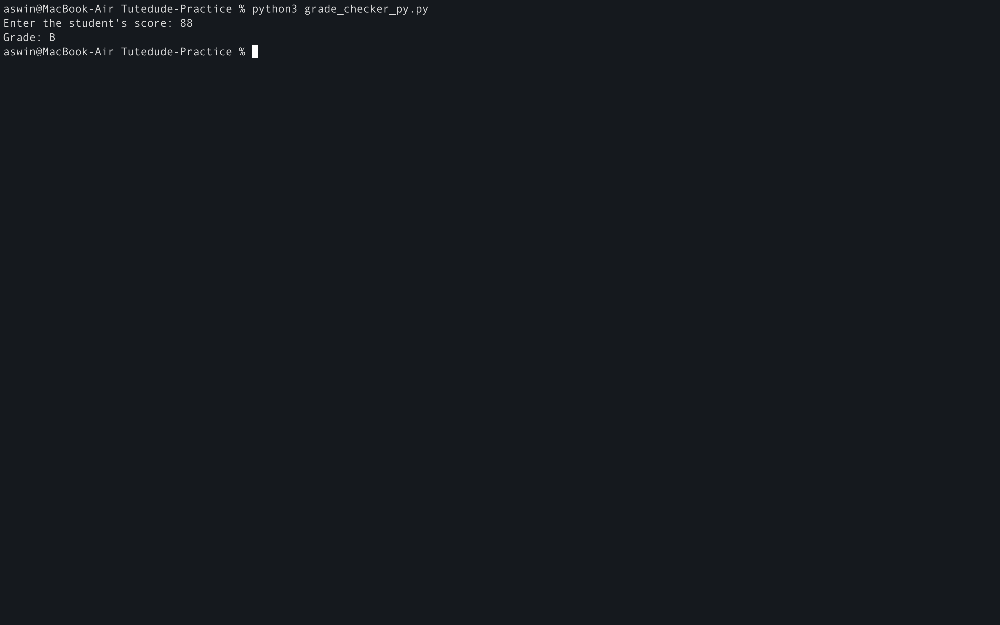
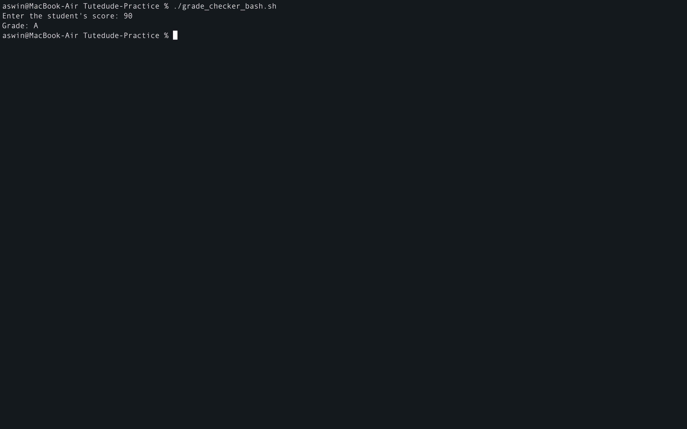
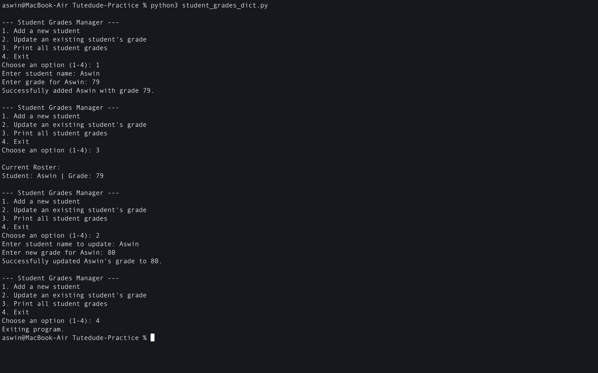
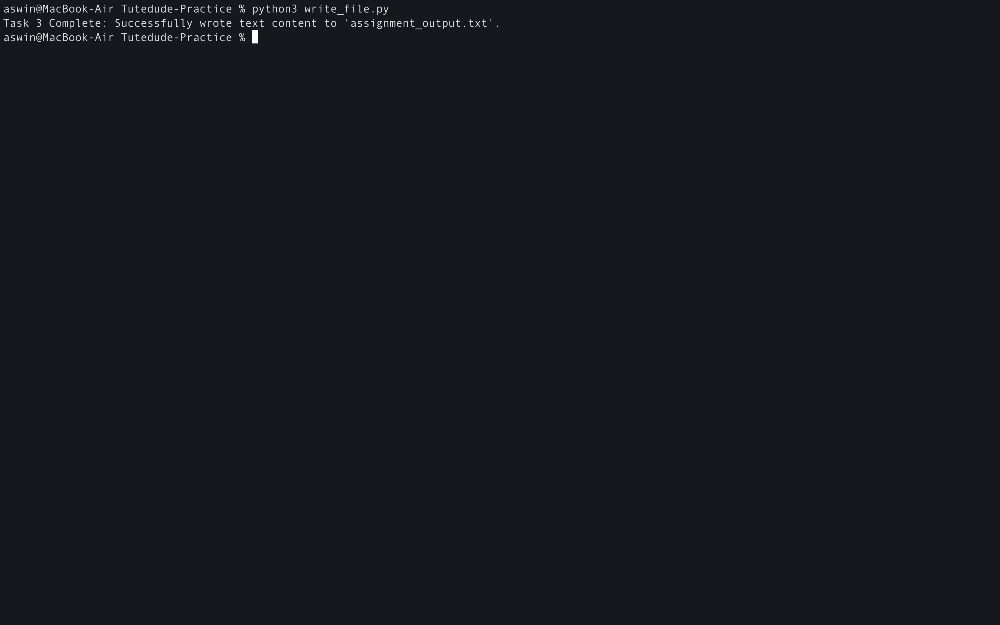
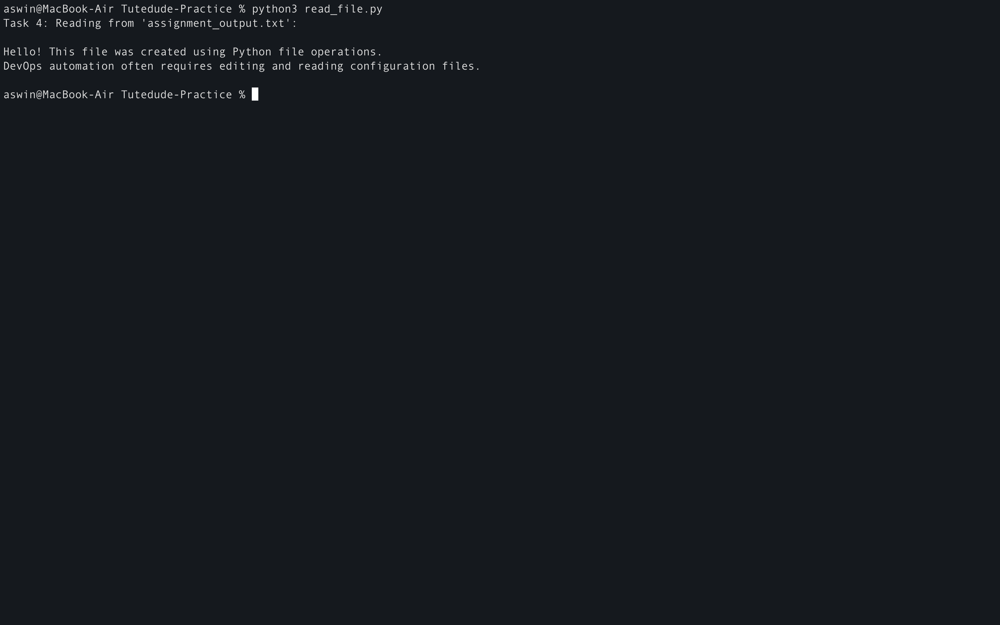
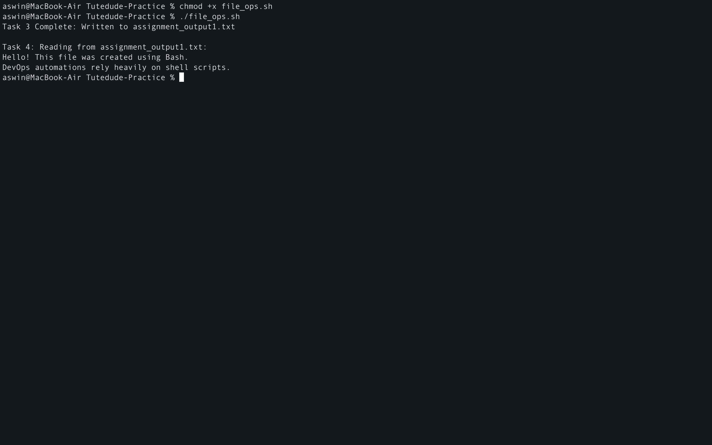

<div align="center">

# Assignment 2 : Python and Bash 

</div>

**Task 1 : Grade Checker**

Python Code
```
# Take a score as input from the user and convert it to an integer
score = int(input("Enter the student's score: "))

# Check the score against the grading scale
if score >= 90:
    print("Grade: A")
elif score >= 80:
    print("Grade: B")
elif score >= 70:
    print("Grade: C")
elif score >= 60:
    print("Grade: D")
else:
    print("Grade: F")
```

Bash Code
```
#!/bin/bash
read -p "Enter the student's score: " score

if [ "$score" -ge 90 ]; then
    echo "Grade: A"
elif [ "$score" -ge 80 ]; then
    echo "Grade: B"
elif [ "$score" -ge 70 ]; then
    echo "Grade: C"
elif [ "$score" -ge 60 ]; then
    echo "Grade: D"
else
    echo "Grade: F"
fi
```
**Python Explanation**
- input() and int(): The program first takes input from the user. Because terminal input is read as a text string by default, we wrap it in int() to convert it into an integer so we can perform mathematical comparisons.

- if-elif-else Structure: Python evaluates the conditions from top to bottom:
    - It first checks if the score is 90 or greater (score >= 90).
    - If that is false, it moves to the elif (else-if) blocks one by one to check lower ranges (80, then 70, then 60).
    - If none of the conditions are met (the score is below 60), the else block catches it and assigns a grade of "F".

- Sequential Logic: Because the conditions are evaluated in order, we don't need to write complex checks like score >= 80 and score < 90. If the code reaches the 80 check, we already know the score is less than 90.




**Bash Explanation**
- read -p: This reads the user's input from the terminal keyboard and stores it in a variable called score. The -p flag stands for "prompt," allowing us to display a custom instruction message on the same line.

- [ "$score" -ge 90 ]: In Bash, we use square brackets for evaluation. Instead of using math symbols like >, we use string-based operators:
    - -ge stands for Greater than or Equal to.

- then, elif, and fi:
    - Every conditional test must be followed by then on the next line (or after a semicolon).
    - Instead of elif, Bash uses elif.
    - The entire if block must be closed using fi ("if" spelled backward). Without it, Bash throws a syntax error.


---

**Task 2 : Student Grades Dictionary**

Python Code
```
# Initialize an empty dictionary to hold student records
student_grades = {}

while True:
    print("\n--- Student Grades Manager ---")
    print("1. Add a new student")
    print("2. Update an existing student's grade")
    print("3. Print all student grades")
    print("4. Exit")
    
    choice = input("Choose an option (1-4): ")
    
    if choice == '1':
        name = input("Enter student name: ")
        if name in student_grades:
            print(f"Error: {name} already exists! Use Option 2 to update.")
        else:
            grade = input(f"Enter grade for {name}: ")
            student_grades[name] = grade
            print(f"Successfully added {name} with grade {grade}.")
            
    elif choice == '2':
        name = input("Enter student name to update: ")
        if name in student_grades:
            new_grade = input(f"Enter new grade for {name}: ")
            student_grades[name] = new_grade
            print(f"Successfully updated {name}'s grade to {new_grade}.")
        else:
            print(f"Error: Student '{name}' not found.")
            
    elif choice == '3':
        if not student_grades:
            print("The dictionary is currently empty.")
        else:
            print("\nCurrent Roster:")
            for name, grade in student_grades.items():
                print(f"Student: {name} | Grade: {grade}")
                
    elif choice == '4':
        print("Exiting program.")
        break
    else:
        print("Invalid choice. Please select a number from 1 to 4.")
```
**Python Explanation**
- The Dictionary (student_grades = {}): A dictionary is an associative array that pairs a unique Key (the student's name) with a Value (their grade). This allows for lightning-fast lookups and updates.

- The Infinite Loop (while True): We wrap the menu in a loop so the program stays open and interactive, allowing you to perform multiple operations back-to-back without restarting the script.

- Core Dictionary Operations Used:
    - Add a Student: Checked if the name already existed using if name in student_grades. If it didn't, we added it using student_grades '[name] = grade.
    - Update a Student: Located the existing key and reassigned its value: student_grades[name] = new_grade.
    - Print All (Iteration): Used a for loop combined with .items() to extract and print both the keys (names) and values (grades) side-by-side: for name, grade in student_grades.items():.
    - Exit: Breaking the infinite loop cleanly using the break statement.



---

**Task 3 : Write to a file**

Python Code
```
file_name = "assignment_output.txt"

# Open the file in write mode ('w'). 
# This automatically creates the file or overwrites it if it already exists.
with open(file_name, "w") as file:
    file.write("Hello! This file was created using Python file operations.\n")
    file.write("DevOps automation often requires editing and reading configuration files.\n")

print(f"Task 3 Complete: Successfully wrote text content to '{file_name}'.")
```
**Explanation**
- The with Statement (Context Manager):
    - In Python, writing with open(...) is the gold standard for file operations. It acts as a context manager that automatically closes the file once the nested code block finishes executing. This prevents memory leaks and file corruption.

- Write Mode ("w"):
    - open(file_name, "w") opens the file in write mode. If the file does not exist, Python creates it. If it does exist, Python clears its existing contents entirely before writing new text using file.write().



---

**Task 4 : Read to a file**

Python Code
```
file_name = "assignment_output.txt"

# Open the file in read-only mode ('r')
print(f"Task 4: Reading from '{file_name}':\n")

try:
    with open(file_name, "r") as file:
        content = file.read()
        print(content)
except FileNotFoundError:
    print(f"Error: The file '{file_name}' does not exist. Please run Task 3 first!")
```
**Explanation**
- Read Mode ("r"):
    - open(file_name, "r") opens the file in read-only mode.
    - file.read() loads the entire text content of the file into memory as a string, which we then print to the console.



---

**Task 3 & 4 : Write and Read file using bash**

Bash Code
```
#!/bin/bash
file_name="assignment_output.txt"

# Task 3: Write using redirection (>) and append (>>)
echo "Hello! This file was created using Bash." > "$file_name"
echo "DevOps automations rely heavily on shell scripts." >> "$file_name"
echo "Task 3 Complete: Written to $file_name"

# Task 4: Read using cat
echo -e "\nTask 4: Reading from $file_name:"
cat "$file_name"
```
**Bash Explanation**
- Redirection Operators:
    - '>' (Overwrite): The single right-arrow redirects the output of the echo command into a file. If the file already exists, it is completely overwritten. This matches Python's "w" mode.
    - '>>' (Append): The double right-arrow appends new text lines to the end of the file without deleting what is already there.

- cat Command:
    - To read the file back to the terminal screen, we run the standard cat (concatenate) utility, which reads the file and outputs its contents directly to the standard output of the shell.

