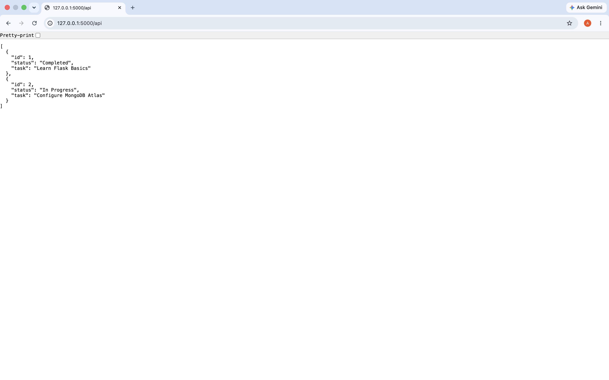
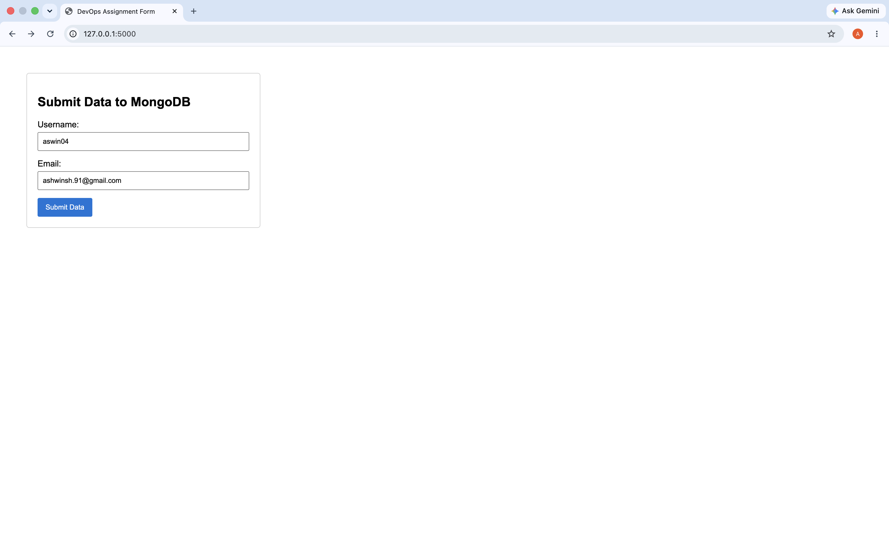
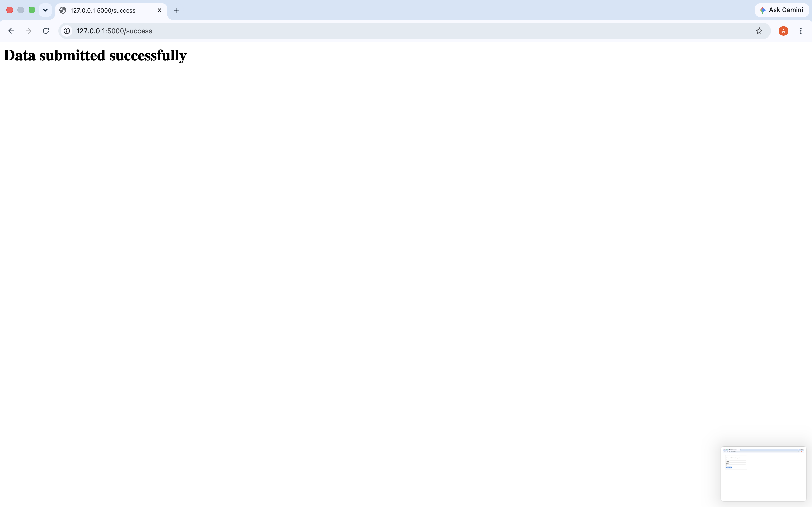
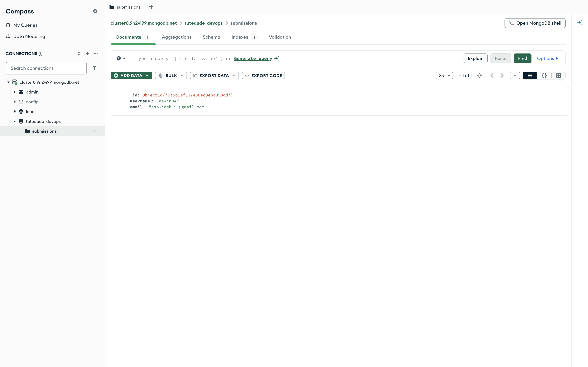

<div align="center">

# Assignment 2 : Flask and MongoDB

</div>

**Task 1 : Create a Flask application with an /api route. When this route is accessed, it should return a JSON list. The data should be stored in a backend file, read from it, and sent as a response.**

JSON Code (data.json)
```
[
  {"id": 1, "task": "Learn Flask Basics", "status": "Completed"},
  {"id": 2, "task": "Configure MongoDB Atlas", "status": "In Progress"}
]
```

Python Code (app.py)
```
from flask import Flask, jsonify, render_template, request, redirect, url_for
import json
from pymongo import MongoClient
from pymongo.errors import PyMongoError

app = Flask(__name__)

# --- MongoDB Atlas Configuration ---
# Replace this with your actual connection string from Atlas
MONGO_URI = "mongodb+srv://<username>:<password>@cluster0.mongodb.net/myDatabase?retryWrites=true&w=majority"

try:
    client = MongoClient(MONGO_URI, serverSelectionTimeoutMS=5000)
    db = client['tutedude_devops']
    collection = db['submissions']
except Exception as e:
    print(f"Initial MongoDB Connection Error: {e}")

# =====================================================================
# TASK 1: Read data from a backend file and return a JSON list
# =====================================================================
@app.route('/api', methods=['GET'])
def get_api_data():
    try:
        # Open and parse the backend json file
        with open('data.json', 'r') as file:
            data = json.load(file)
        return jsonify(data), 200
    except FileNotFoundError:
        return jsonify({"error": "Backend data file not found"}), 404
    except json.JSONDecodeError:
        return jsonify({"error": "Invalid JSON format in backend file"}), 500

# =====================================================================
# TASK 2: Frontend Form processing with MongoDB Atlas
# =====================================================================
@app.route('/', methods=['GET', 'POST'])
def home_form():
    error_message = None
    
    if request.method == 'POST':
        # Extract data from the submitted form fields
        username = request.form.get('username')
        email = request.form.get('email')
        
        # Validate that fields aren't completely empty
        if not username or not email:
            error_message = "All fields are required!"
            return render_template('form.html', error=error_message)
            
        try:
            # Attempt to insert data into the MongoDB Atlas Collection
            document = {"username": username, "email": email}
            collection.insert_one(document)
            
            # Redirect to the success page upon smooth execution
            return redirect(url_for('success_page'))
            
        except PyMongoError as e:
            # Stay on the same page and pass the exact database error string
            error_message = f"Database Error: {str(e)}"
            return render_template('form.html', error=error_message)
            
    return render_template('form.html', error=error_message)

@app.route('/success')
def success_page():
    return "<h1>Data submitted successfully</h1>"

if __name__ == '__main__':
    app.run(debug=True, port=5000)
```
**Python Explanation**
- Explanation: This route processes GET HTTP requests. It targets a static flat file (data.json) residing on the server's hard drive. It implements Python's native json.load() parser to map the raw text directly into valid Python data types, which are then formatted via Flask's jsonify() utility to guarantee a pure application/json Content-Type response header.



---

**Task 2 : Create a form on the frontend that, when submitted, inserts data into MongoDB Atlas. Upon successful submission, the user should be redirected to another page displaying the message "Data submitted successfully". If there's an error during submission, display the error on the same page without redirection.**

HMTL Code (form.html)
```
<!DOCTYPE html>
<html lang="en">
<head>
    <meta charset="UTF-8">
    <title>DevOps Assignment Form</title>
    <style>
        body { font-family: Arial, sans-serif; margin: 50px; }
        .form-container { max-width: 400px; padding: 20px; border: 1px solid #ccc; border-radius: 5px; }
        .error-box { color: white; background-color: #d9534f; padding: 10px; margin-bottom: 15px; border-radius: 3px; }
        .input-group { margin-bottom: 15px; }
        .input-group label { display: block; margin-bottom: 5px; }
        .input-group input { width: 95%; padding: 8px; }
        button { background-color: #0275d8; color: white; padding: 10px 15px; border: none; cursor: pointer; border-radius: 3px; }
    </style>
</head>
<body>

    <div class="form-container">
        <h2>Submit Data to MongoDB</h2>
        
        <!-- Task 2 Requirement: Render error on the same page without redirecting -->
        
            <div class="error-box">
                <strong>Error:</strong> {{ error }}
            </div>
        

        <form method="POST" action="/">
            <div class="input-group">
                <label for="username">Username:</label>
                <input type="text" id="username" name="username" required>
            </div>
            <div class="input-group">
                <label for="email">Email:</label>
                <input type="email" id="email" name="email" required>
            </div>
            <button type="submit">Submit Data</button>
        </form>
    </div>

</body>
</html>
```
**HTML Explanation**
- Explanation: The application implements dynamic rendering via standard POST collection routing. When the HTML form actions are triggered, the script attempts connectivity to the cloud-hosted MongoDB Atlas layer using the pymongo driver interface.

- State Control (Errors vs. Redirections):
    - If the write operation completes perfectly, the execution context invokes redirect(), rendering a clean downstream success state (/success).
    - If the application loses database socket handshakes or encounters processing exceptions, the driver throws a PyMongoError. The logic intercepts this using a try-except guard block, catches the failure state instantly, bypasses the redirect, and injects the error logs into the client-side Jinja context block on the current template engine.







---
<div align="center">

## How to setup/run the flask app

</div>

**Step 1 : Structure Your Directory**
```
my-flask-app/
├── templates/
│   └── form.html
├── app.py
└── data.json
```

**Step 2 : Create and virtual environment and install dependencies**
```
# Creating Virtual Environment
python3 -m venv .venv
source .venv/bin/activate    #MAC OS

# Installing Dependencies 
pip3 install flask pymongo dnspython
```

**Step 3 : Start the server**
```
app.py
```

**Step 4 : To test the assignment**
```
# Task 1
http://127.0.0.1:5000/api

# Task 2 
http://127.0.0.1:5000/
```