<div align="center">

# Assignment 4 : GIT and Github

</div>

**Task 1 : Repository Initialization & SSH Setup**

Step 1 : Generate SSH Key and add it to Github
```
ssh-keygen -t ed25519 -C "your_email@example.com"
cat ~/.ssh/id_ed25519.pub  ---------> # Copy this ssh key to github and add to SSH and GPG keys in settings 
```

Step 2 : Clone, Branch, Initial Commit
```
# Clone the repository using SSH
git clone git@github.com:YOUR_GITHUB_USERNAME/tutedude-devops-git.git
cd tutedude-devops-git

# Create and switch to a branch named after your username
git checkout -b aswinshine

# Copy your Task 3 Flask project files into this folder, then stage them
git add .
git commit -m "Initial commit of Flask project files"

# Push the username branch to GitHub
git push origin aswinshine

# Switch back to main and merge the username branch
git checkout main
git merge aswinshine
git push origin main
```
**Explanation**
- Asymmetric Cryptography (ed25519): Generating an SSH key pair creates two mathematical keys: a private key (kept strictly secure on your local Mac) and a public key (uploaded to GitHub). The ed25519 algorithm is an elliptic curve signature scheme that offers faster performance and higher security than older RSA keys with significantly shorter key lengths.

- The Git Cloning Process: When you run git clone, Git downloads the entire history database of the remote repository, creates a dynamic remote tracking connection named origin, and automatically checks out the default tracking branch (usually main).

- Branch Isolation (git checkout -b): This command is a shorthand combination that performs two actions at once: it creates a new pointer in the Git object database pointing to your current snapshot commit, and shifts your HEAD pointer to track that new branch name. This allows you to work without altering the stable code residing on the master timeline.

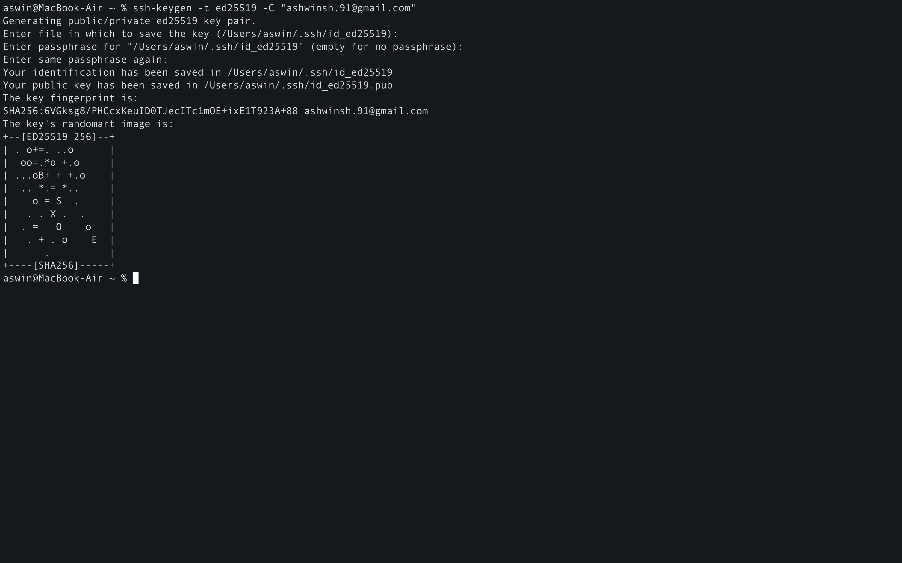

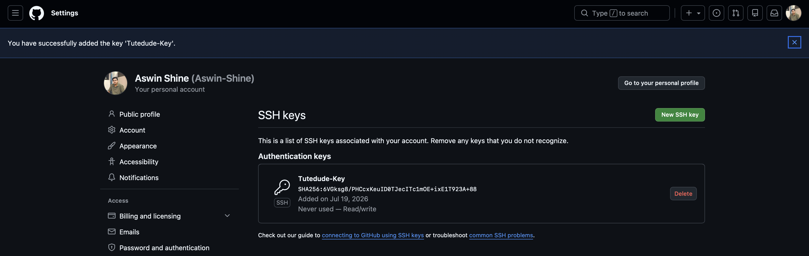

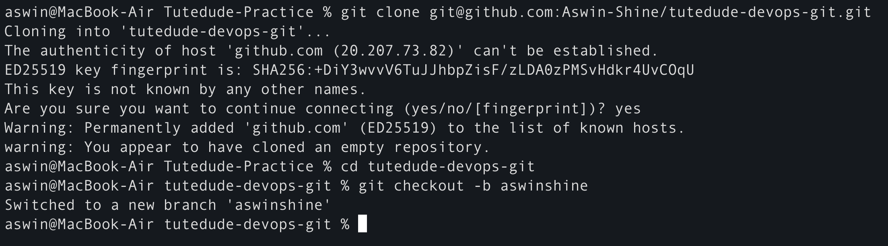

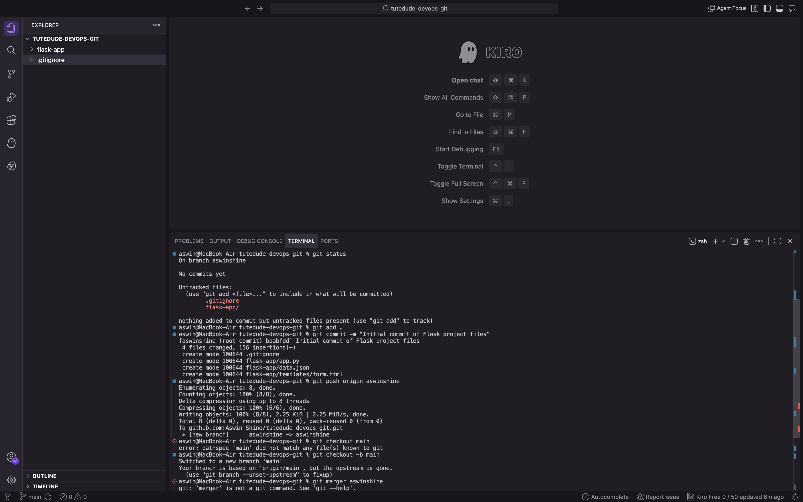

---

**Task 2 : Feature Branching and Conflict Resolution**

Step 1 : Simulate standard updates on the Main Branch
```
echo '[{"id": 1, "task": "Main branch mutation", "status": "Pending"}]' > data.json
git add data.json
git commit -m "Update JSON content on main branch"
git push origin main
```

Step 2 : Create a separate feature branch and modify the same lines
```
# Create and move to the new feature branch
git checkout -b aswinshine_new

# Update the exact same JSON file with different values
echo '[{"id": 1, "task": "Feature branch mutation", "status": "Active"}]' > data.json
git add data.json
git commit -m "Update JSON layout on feature branch"
```

Step 3 : Trigger and Resolve the Conflict
```
# Switch back to main and attempt to merge the new branch
git checkout main
git merge aswinshine_new
```

Step 4 : Open data.json in a editor, you can see the conflict
```
/<<<<<<< HEAD
[{"id": 1, "task": "Main branch mutation", "status": "Pending"}]
=======
[{"id": 1, "task": "Feature branch mutation", "status": "Active"}]
>>>>>>> aswinshine_new

# Remove everything and keep this only
[{"id": 1, "task": "Feature branch mutation", "status": "Active"}]
```

Step 5 : Stage, commit, and push the resolved file
```
git add data.json
git commit -m "Fix merge conflict by accepting aswinshine_new branch mutations"
git push origin main
```
**Explanation**
- How Git Tracks Changes: Git does not store files as standard diff patches; it tracks content snapshots using a Directed Acyclic Graph (DAG). When you modify data.json on the main branch, and a peer modifies the exact same lines of data.json on the aswinshine_new branch, both branches diverge from a shared ancestral commit.

- The Anatomy of a Merge Conflict: When you attempt to bring the code paths back together with git merge, Git runs a Three-Way Merge Algorithm. It evaluates the common ancestor commit against the states of both current branches. Because the same lines were modified in different ways, Git cannot programmatically determine which logic path takes precedence.

- Manual Resolution: The merge halts, leaving the index in an unmerged state. Git injects visible structural conflict boundaries (<<<<<<<, =======, >>>>>>>) directly into the file layout. Deleting these markers and staging the file manually creates a brand new Merge Commit that establishes a fresh, combined state.

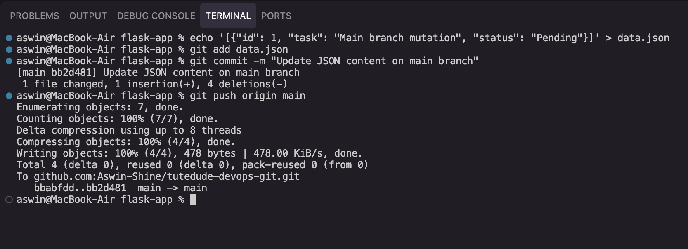

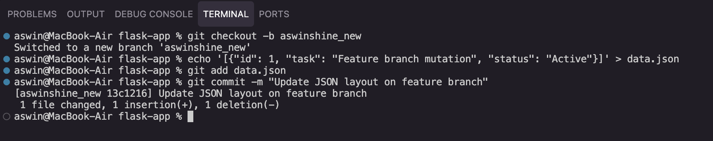

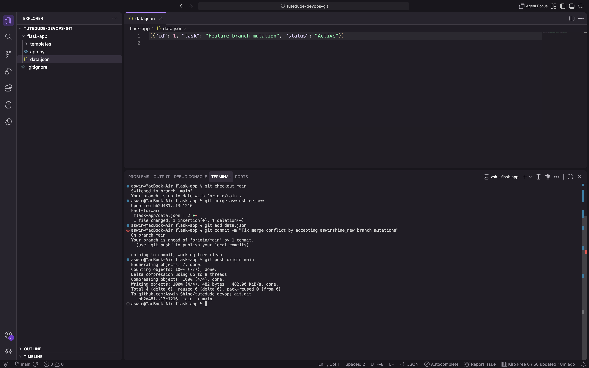

---

**Task 3 : Parallel Feature Branch Deploys**

Step 1 : Branch Off From Main
```
git branch master_1
git branch master_2
```

Step 2 : Frontend Engineering on master_1 and create templates/todo.html containing the web form.
```
git checkout master_1
```
HTML CODE (templates/todo.html)
```
<!DOCTYPE html>
<html>
<head><title>To-Do Page</title></head>
<body>
    <h2>Create To-Do Item</h2>
    <form action="/submittodoitem" method="POST">
        <label>Item Name:</label><br>
        <input type="text" name="itemName" required><br><br>
        <label>Item Description:</label><br>
        <textarea name="itemDescription" required></textarea><br><br>
        <button type="submit">Add Item</button>
    </form>
</body>
</html>
```

Step 3 : Commit and save changes
```
git add templates/todo.html
git commit -m "Add core To-Do form layout inside templates"
```

Step 4 : Backend Engineering on master_2 and update app.py
```
git checkout master_2
```
PYTHON CODE (app.py)
```
# Append this 
@app.route('/todo')
def todo_view():
    return render_template('todo.html')

@app.route('/submittodoitem', methods=['POST'])
def submit_todo_item():
    item_name = request.form.get('itemName')
    item_desc = request.form.get('itemDescription')
    
    try:
        # Connect to your existing MongoDB configuration instance
        db.todo_collection.insert_one({
            "itemName": item_name,
            "itemDescription": item_desc
        })
        return "<h3>To-Do Item Added Safely to MongoDB</h3>", 200
    except Exception as e:
        return f"Database Error: {str(e)}", 500
```

Step 5 : Commit and save changes
```
git add app.py
git commit -m "Add /submittodoitem POST route handling MongoDB persistence"
```

Step 6 : Merge Both Branches to Main
```
git checkout main
git merge master_1 --no-edit
git merge master_2 --no-edit
git push origin main
```
**Explanation**
- Parallel Workstreams: In an enterprise environment, separating frontend interface logic (master_1) from database engine operations (master_2) prevents overlapping changes. A frontend engineer can write HTML structure without needing a functioning database configuration present in their environment, and vice versa.

- Non-Fast-Forward Merges (--no-edit): When you merge these branches back into the main timeline, if the main branch hasn't drifted, Git will try to perform a "Fast-Forward" merge (simply shifting the branch pointer forward without creating a new commit). Using structural checks or standard parallel merges forces Git to generate an explicit merge commit node. This acts as a permanent historical marker showing exactly when that entire feature block was integrated into production.

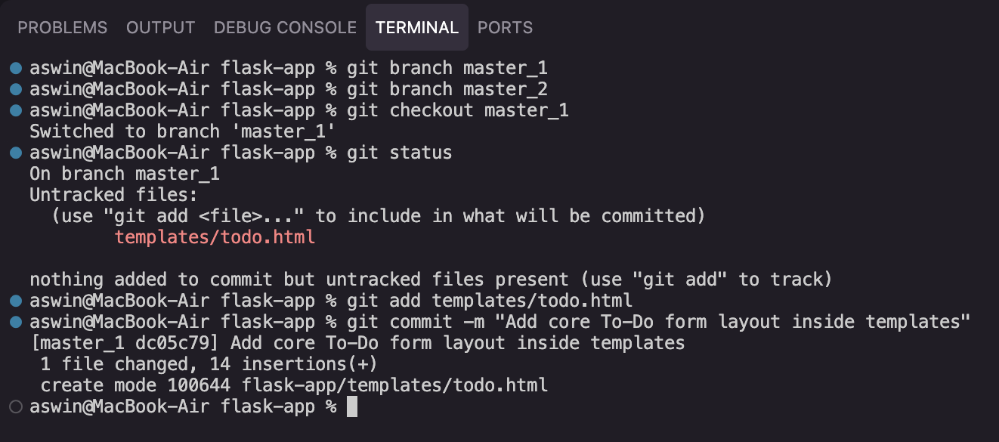

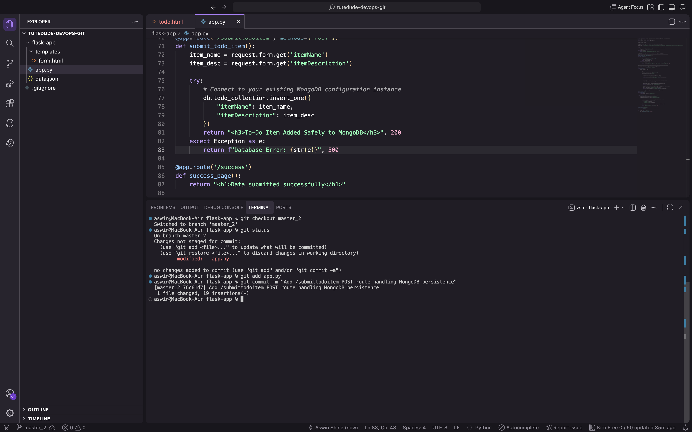

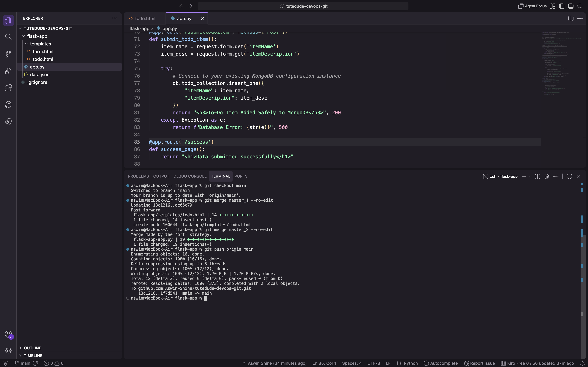

---

**Task 4 : Advanced Git History Re-Writing (Reset & Rebase)**

Step 1 : Sequential Commits on master_1 and append new inputs
```
git checkout master_1
git merge main --no-edit # Bring master_1 up to date first

# Todo HTML (templates/todo.html) -------------> Commit 1 
<!-- Add right before button element -->
<label>Item ID:</label><br>
<input type="text" name="itemId"><br><br>

git add templates/todo.html
git commit -m "Add Item ID field"

# Todo HTML (templates/todo.html) -------------> Commit 2
<label>Item UUID:</label><br>
<input type="text" name="itemUuid"><br><br>

git add templates/todo.html
git commit -m "Add Item UUID field"

# Todo HTML (templates/todo.html) -------------> Commit 3
<label>Item Hash:</label><br>
<input type="text" name="itemHash"><br><br>

git add templates/todo.html
git commit -m "Add Item Hash field"
```

Step 2 : Merge into main
```
git checkout main
git merge master_1 --no-edit
```

Step 3 : Soft reset to rollback commit histroy 
```
git log --oneline
git reset --soft <HASH_OF_ITEM_ID_COMMIT>

git commit -m "Rollback tracking state - consolidate inputs to Item ID foundation"
git push origin main --force
```

Step 4 : Rebase to keep commit logs intact
```
git rebase main master_1
```
**Explanation**
- Parallel Workstreams: In an enterprise environment, separating frontend interface logic (master_1) from database engine operations (master_2) prevents overlapping changes. A frontend engineer can write HTML structure without needing a functioning database configuration present in their environment, and vice versa.

- Non-Fast-Forward Merges (--no-edit): When you merge these branches back into the main timeline, if the main branch hasn't drifted, Git will try to perform a "Fast-Forward" merge (simply shifting the branch pointer forward without creating a new commit). Using structural checks or standard parallel merges forces Git to generate an explicit merge commit node. This acts as a permanent historical marker showing exactly when that entire feature block was integrated into production.

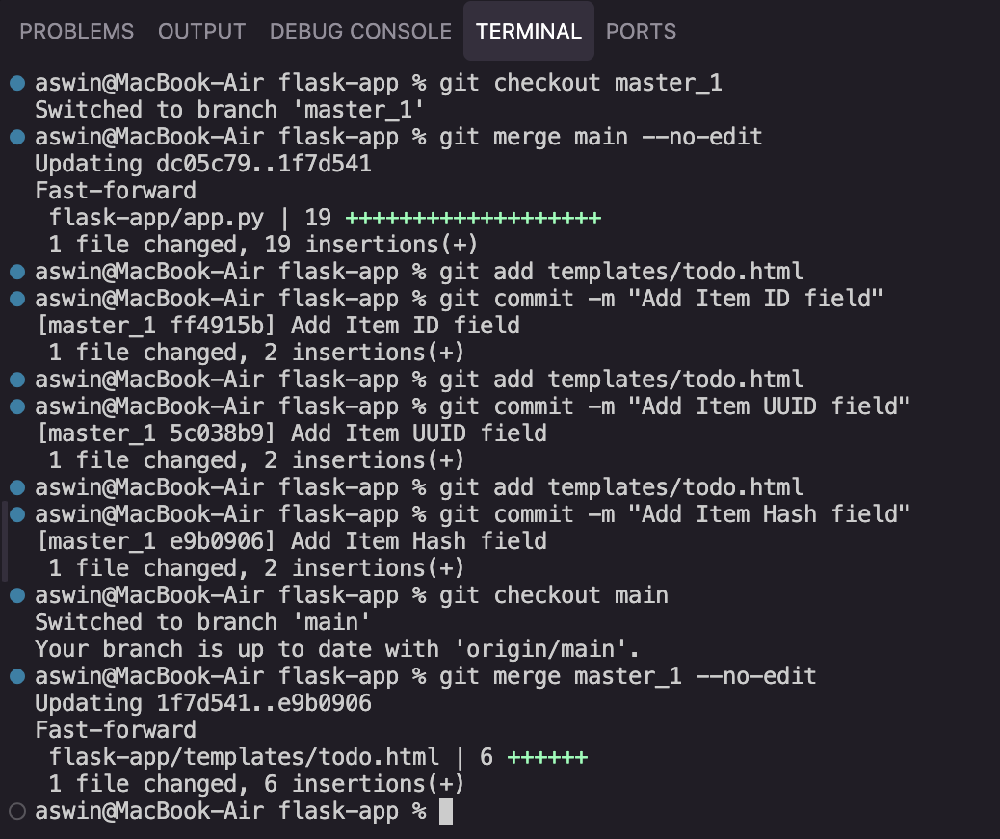

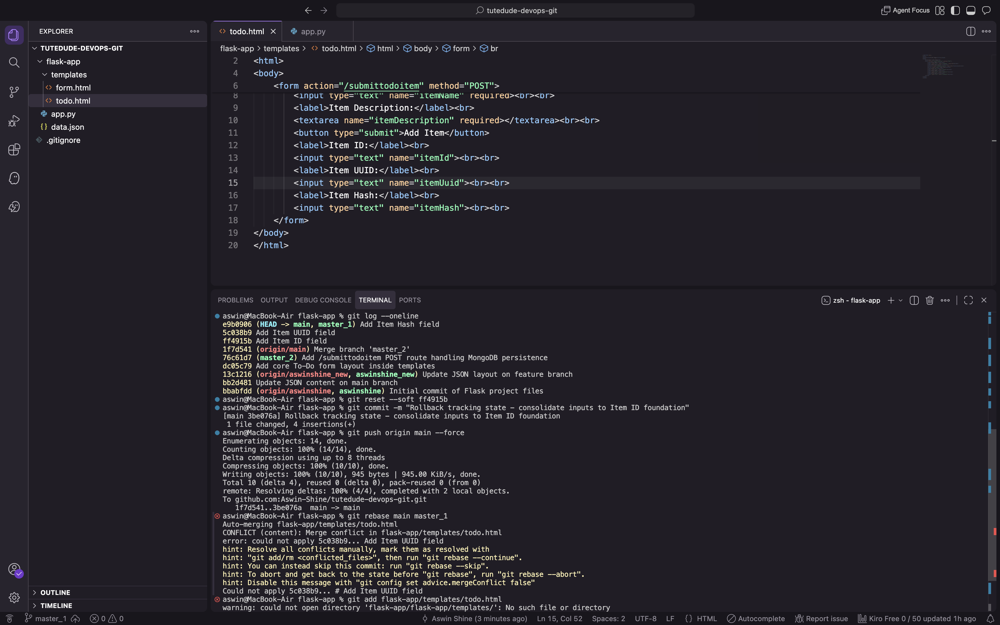

