<div align="center">

# Assignment 6 : AWS

</div>

**Task 1 : Deploy Your flask backend and express frontend in amazon single ec2 instance**

Task 1 : Achitecture
```
               ┌─────────── Single EC2 Instance (Public IP) ───────────-┐
               │                                                        │
Internet ─────>│  Port 3000 ──> [ Node UI ] ──( Docker Net )──> [ API ] │
               │                                                        │
               └───────────────────────────────────────────────────────-┘
```

Step 1 : Provision the Virtual Machine
- Go to the AWS EC2 Console → Launch Instance.
- AMI: Ubuntu Server 24.04 LTS.
- Instance Type: t2.micro (AWS Free Tier Eligible).
- Security Group Rules:
    - Inbound SSH (Port 22) from your IP.
    - Inbound HTTP (Port 3000) from Anywhere (0.0.0.0/0).

Step 2 : Initialize the Instance Environment
```
# Update the APT package index manager
sudo apt-get update -y
sudo apt-get upgrade -y

# Install the Docker runtime engine & Compose plugin
sudo apt-get install docker.io docker-compose-v2 -y
sudo usermod -aG docker $USER
newgrp docker
```

Step 3 : Clone and Boot the Application Stack
```
git clone https://github.com/Aswin-Shine/tutedude-flask-app.git
cd tutedude-flask-app

# Launch the application in detached background mode
docker compose up -d
```

**Explanation**
- Resource Co-location & Virtual Bridge Network: Both application tiers share the underlying hardware resources (vCPU, RAM, storage) of a single Amazon EC2 t2.micro instance running Ubuntu Server. Using Docker Compose, both containers are connected to a shared internal virtual bridge network (devops_bridge_net).

- Container Name-Based Routing: Docker’s embedded DNS service automatically handles domain resolution between the two containers. The Node.js application routes internal API requests to http://backend:5000/api/submit without needing external network hops or public IP addresses.

- Security Group Configuration: The EC2 Security Group acts as a stateful virtual firewall, opening only Port 22 for SSH administration and Port 3000 to expose the Express web interface to the public internet (0.0.0.0/0). Port 5000 (Flask API) remains unexposed externally, keeping the database pipeline secure.

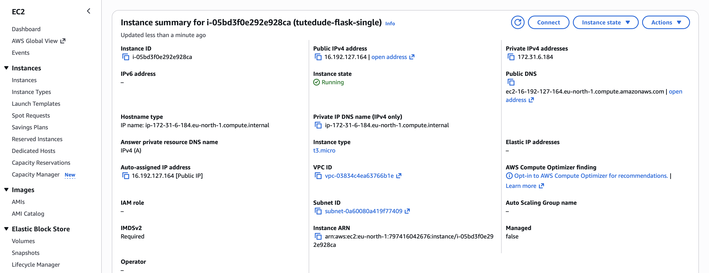

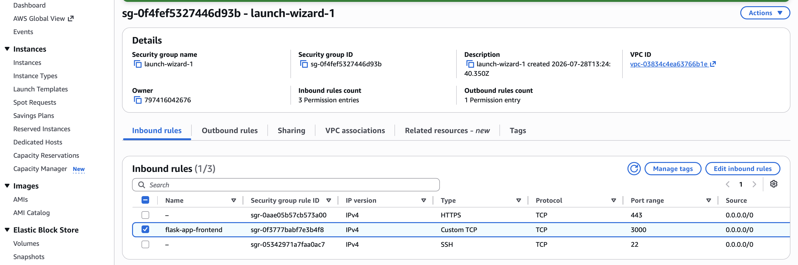

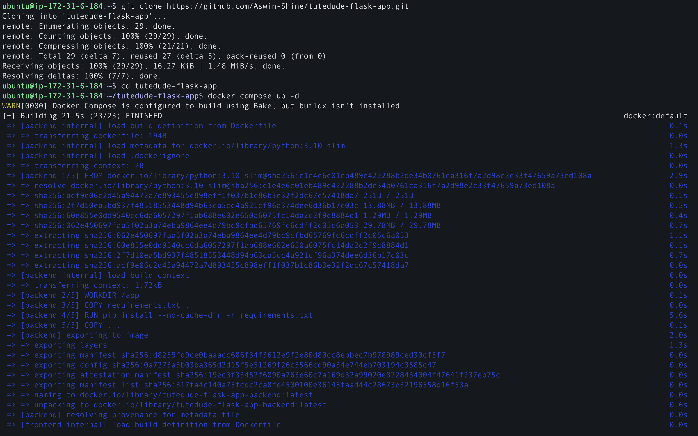

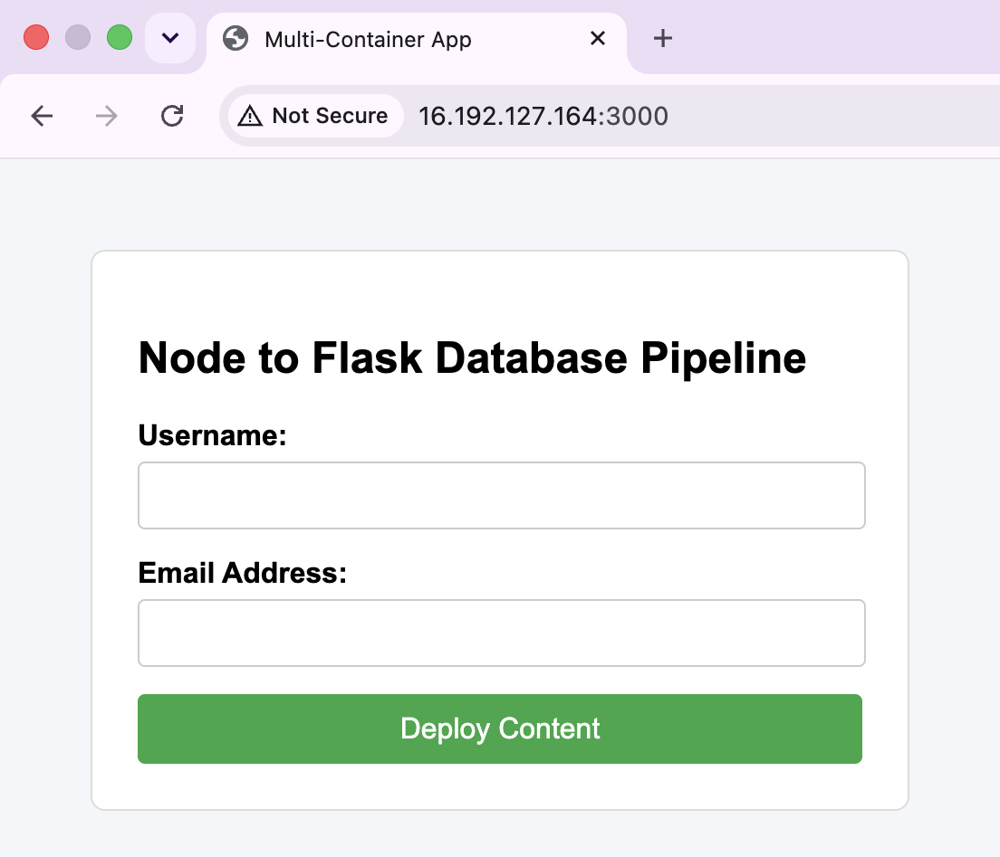

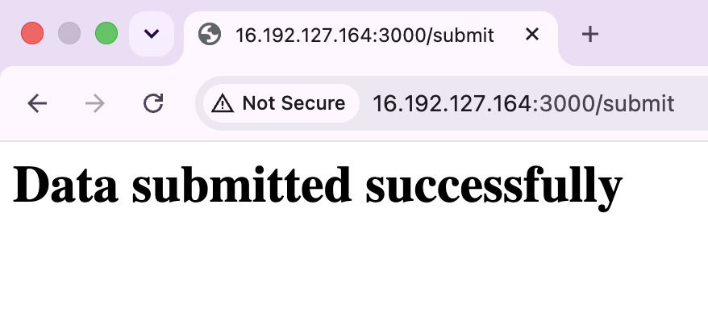

---

**Task 2 : Deploy Your flask backend and express frontend in separate ec2 instances**

Task 2 : Architecture
```
               ┌──────────────────┐           ┌──────────────────┐
               │   EC2 Instance   │           │   EC2 Instance   │
Internet ─────>│ (Node Frontend)  │──────────>│ (Flask Backend)  │
               │    Port 3000     │           │    Port 5001     │
               └──────────────────┘           └──────────────────┘
```

Step 1 : Provision the Tiered Instances

Launch two separate t2.micro Ubuntu EC2 instances:
- Frontend-Server: Open Port 3000 to the internet (0.0.0.0/0).
- Backend-Server: Open Port 5001 strictly to the Private IP address or Security Group of the Frontend-Server.

Step 2 : Configure the Backend Container Engine 
```
#SSH into your Backend-Server and run the standalone Python API container:

sudo apt-get update && sudo apt-get install docker.io -y
# Pull and run the backend image directly from Docker Hub
docker run -d -p 5001:5001 \
  -e MONGO_URI="mongodb+srv://..." \
  aswinshine/flask-backend:v1
```

Step 3 : Configure the Frontend Presentation Engine
```
#SSH into your Frontend-Server 

# Spin up the frontend UI targeting the distinct backend machine
docker run -d -p 3000:3000 \
  -e BACKEND_URL="http://<BACKEND_PRIVATE_IP>:5001/api/submit" \
  aswinshine/node-frontend:v1
```

**Explanation**
- Infrastructure Decoupling: The Node.js frontend and Flask backend run on two independent t2.micro EC2 instances (Frontend-Server and Backend-Server). This ensures that compute overhead, memory consumption, and runtime failures on one instance do not directly impact the other.

- Private IP Inter-Instance Communication: Instead of sending traffic over the public internet, the Node.js frontend container is configured via environment variables (BACKEND_URL) to communicate directly with the Private IP address of the Backend-Server instance inside the default AWS VPC.

- Granular Network Security:
    - Frontend Security Group: Accepts public web traffic on Port 3000 (0.0.0.0/0).
    - Backend Security Group: Restricts inbound traffic on Port 5001 strictly to requests originating from the private IP address or Security Group ID of the Frontend-Server. This prevents unauthorized external access to the API tier.

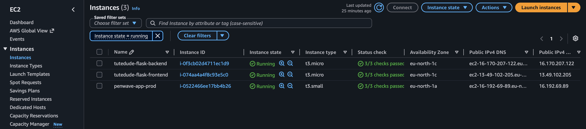

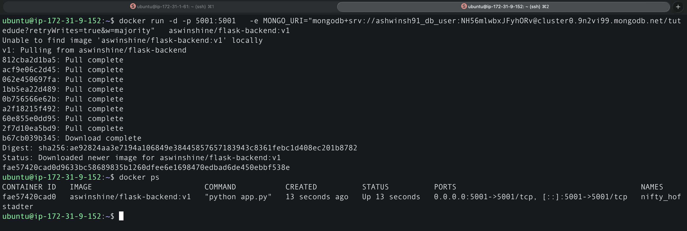

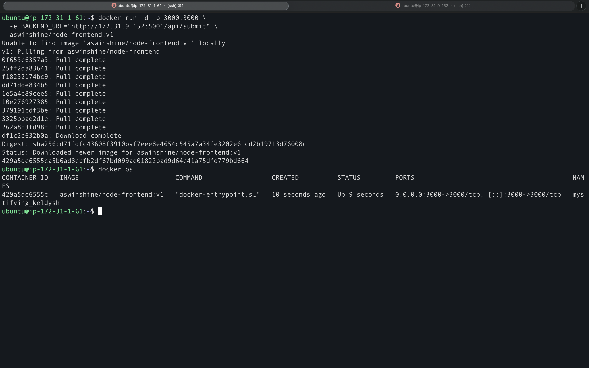

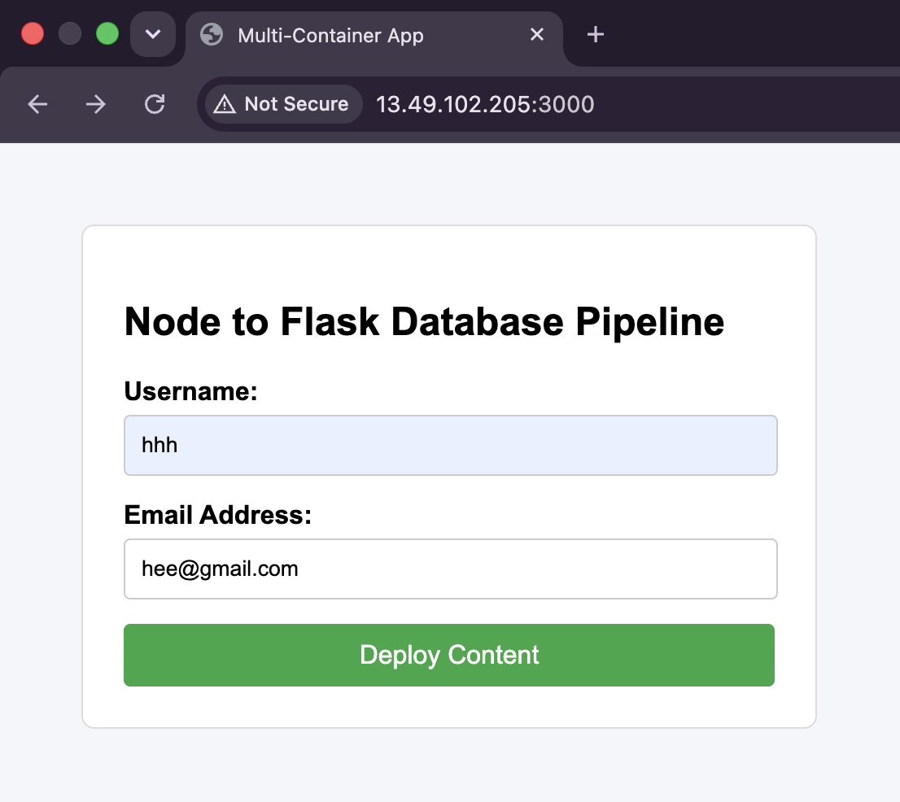

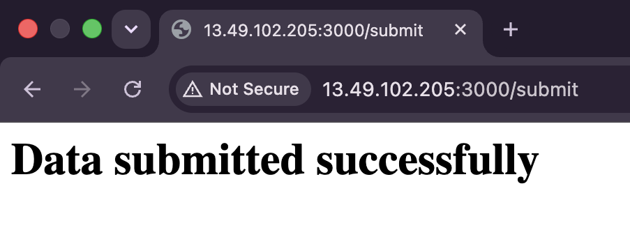

---

**Task 3 : Deploy Your flask backend and express frontend Docker Container using aws ecr, ecs and vpc services**

Task 3 : Architecture
```
               ┌─────────────────────── Secure AWS VPC ───────────────────────┐
               │                                                              │
Internet ─────>│  [ Application Load Balancer ] ────( Private ECS Subnet )    │
               │                                           │                  │
               │                                           ▼                  │
               │                                 [ ECS Fargate Cluster ]      │
               │                                  ├── Task: Node Frontend     │
               │                                  └── Task: Flask Backend     │
               └──────────────────────────────────────────────────────────────┘
```

Step 1 : Create a Secure Networking Layout (Amazon VPC)

Use the AWS VPC Wizard to quickly roll out a highly available network infrastructure:
- Subnets: Create 2 Public Subnets (for user access) and 2 Private Subnets (for container security) distributed across 2 separate Availability Zones.
- Routing: Attach an Internet Gateway to guide public web traffic into the public subnets.

Step 2 : Push Application Images to Amazon ECR (Elastic Container Registry)

Create two private repositories in the ECR Console: node-frontend and flask-backend. Log in from your local terminal and push your images directly to AWS:
```
# Authenticate your local Docker CLI against AWS ECR
aws ecr get-login-password --region eu-north-1 | docker login --username AWS --password-stdin <AWS_ACCOUNT_ID>.dkr.ecr.eu-north-1.amazonaws.com

# Tag and Push the API layer
docker tag aswinshine/flask-backend:v1 <AWS_ACCOUNT_ID>.dkr.ecr.eu-north-1.amazonaws.com/flaskbackend:latest
docker push <AWS_ACCOUNT_ID>.dkr.ecr.eu-north-1.amazonaws.com/flaskbackend:latest

# Tag and Push the UI layer
docker tag aswinshine/node-frontend:v1 <AWS_ACCOUNT_ID>.dkr.ecr.eu-north-1.amazonaws.com/nodefrontend:latest
docker push <AWS_ACCOUNT_ID>.dkr.ecr.eu-north-1.amazonaws.com/nodefrontend:latest
```

Step 3 : Define ECS Task Structures & Service Orchestration
- Create an ECS Cluster: Go to Amazon ECS → Clusters → Create a cluster using the AWS Fargate (Serverless) infrastructure engine.

- Define Task Definitions:
    - Create a Fargate task family specifying your hardware limits (e.g., 0.5 vCPU and 1 GB RAM).
    - Add both container definitions inside this single task, using the image URLs generated by your Amazon ECR repositories.
    - Inject the database environment keys (MONGO_URI) and specify the internal communication endpoint (BACKEND_URL=(http://127.0.0.1:5000/api/submit)(http://127.0.0.1:5001/api/submit)).

- Deploy the ECS Service: Deploy the task definition inside your cluster. Connect it to an Application Load Balancer (ALB) sitting inside your public subnets to expose port 3000 to the internet.

**Explanation**
- Container Registry Management (Amazon ECR): Production container images are compiled, tagged, and pushed to AWS ECR—a secure, fully managed private container registry. This replaces public registries (like Docker Hub) and ensures fast, encrypted image pulls directly within the AWS network.

- Serverless Execution Engine (AWS ECS Fargate): AWS Fargate handles the underlying compute infrastructure automatically. Instead of provisioning, patching, and managing raw Linux EC2 instances, Fargate launches and manages isolated container tasks based on defined CPU and memory constraints (vCPU and RAM).

- VPC Networking & Shared Task Space:
    - Both containers are deployed as part of a unified ECS Task Definition running inside a secure VPC across multiple Availability Zones.
    - Because both containers execute within the same Fargate Task definition, they share a network namespace (awsvpc network mode). The Node.js frontend can communicate with the Flask backend API via local loopback ((http://127.0.0.1:5000)(http://127.0.0.1:5000)), reducing inter-container communication overhead.

- Application Load Balancer (ALB): Public traffic lands on an AWS Application Load Balancer sitting in the public subnets, which safely routes incoming HTTP requests to port 3000 of the active Fargate tasks running in the container cluster.

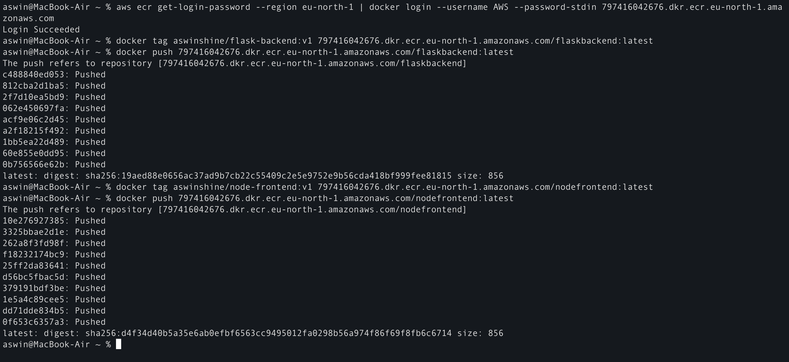

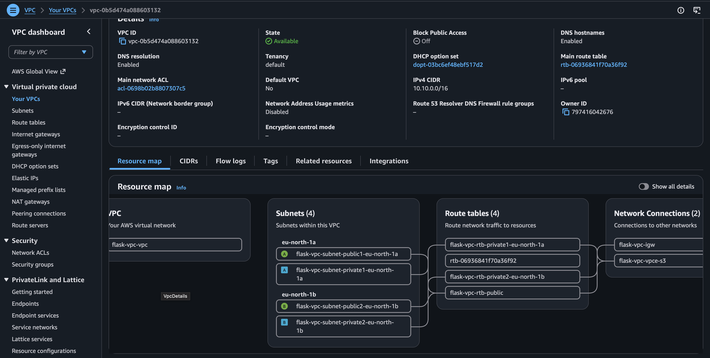

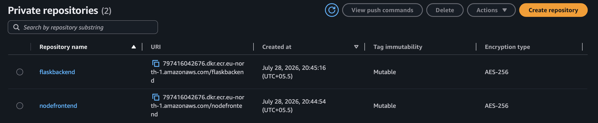

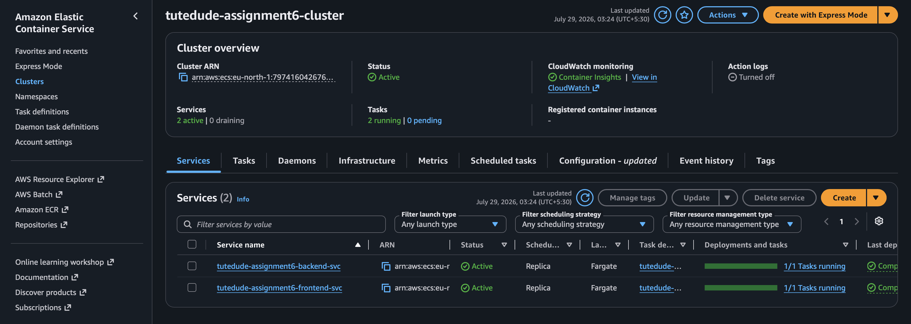

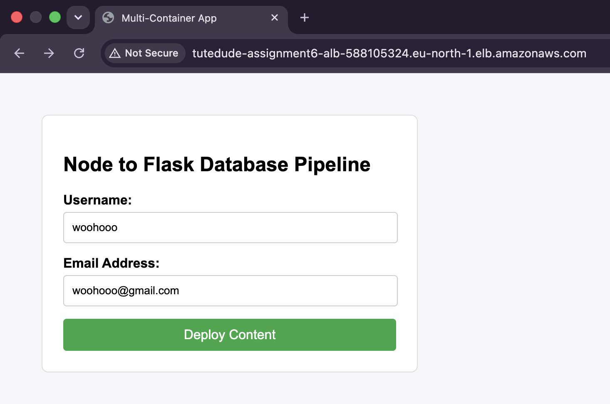

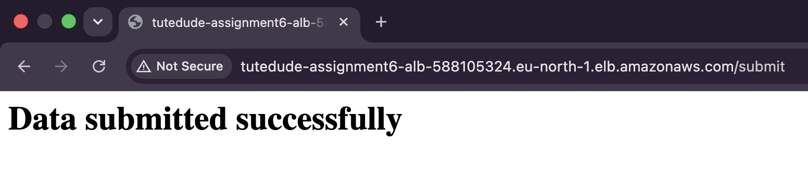
---


<div align="center">

# LIVE LINK

http://tutedude-assignment6-alb-588105324.eu-north-1.elb.amazonaws.com

</div>
