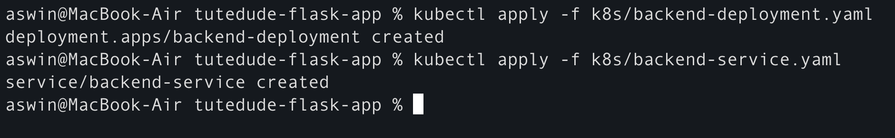
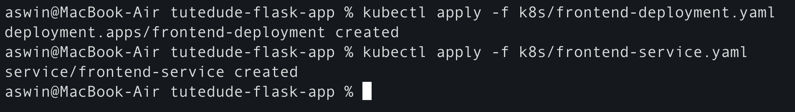
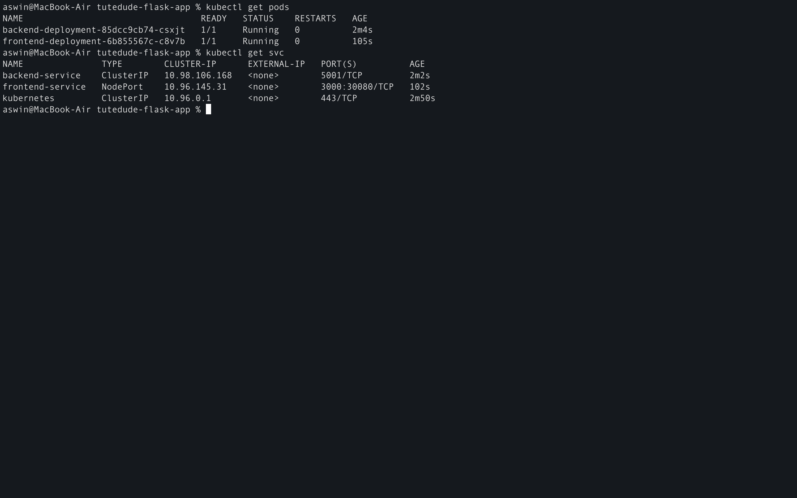
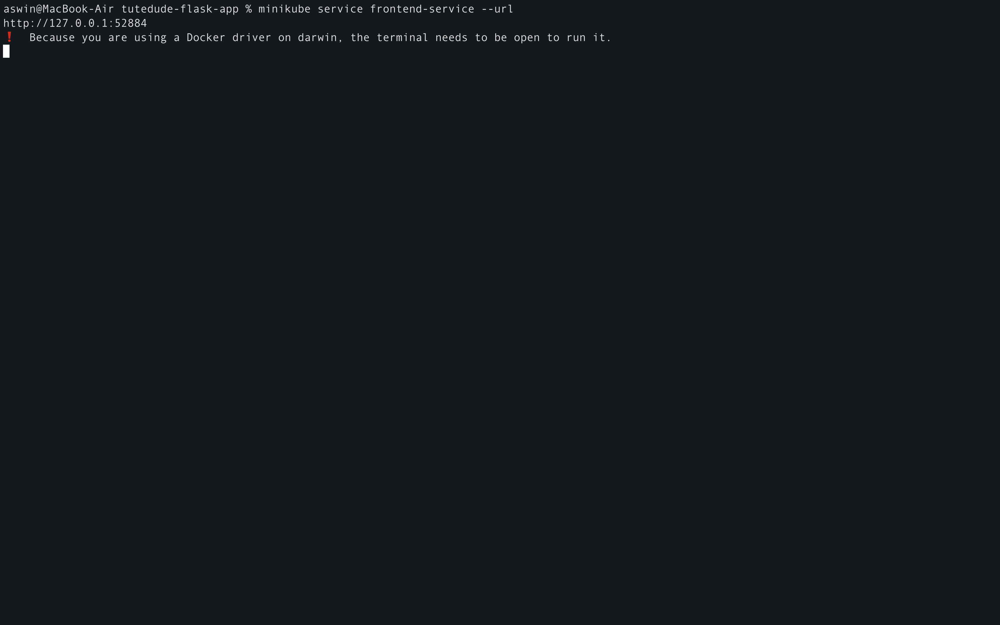
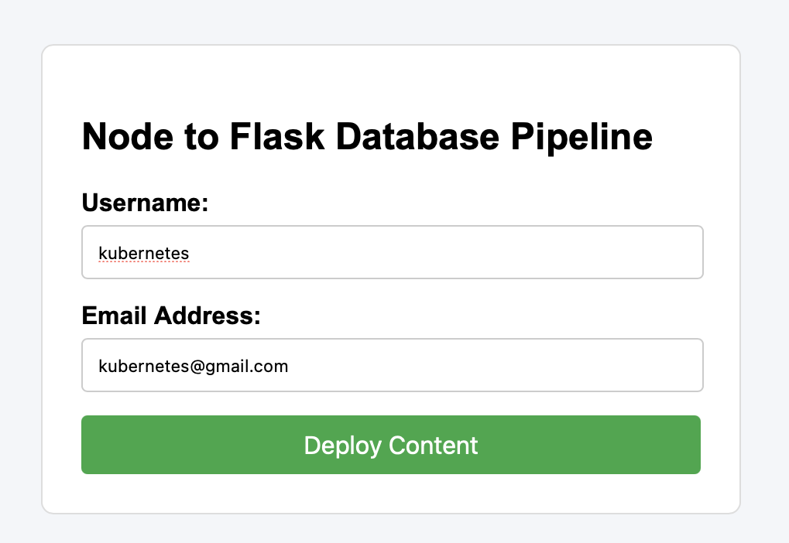

<div align="center">

# Assignment 7 : Kubernetes

</div>

**Task : Deploy your your previous assignment flask frontend and express backend in kubernetes cluster locally with minikube**

Directory Structure
```
tutedude-flask-app/
├── backend/
│   ├── app.py
│   ├── Dockerfile
│   └── requirements.txt
├── frontend/
│   ├── views/
│   │   └── form.ejs
│   ├── Dockerfile
│   ├── package.json
│   └── server.js
├── k8s/
│   ├── backend-deployment.yaml
│   ├── backend-service.yaml
│   ├── frontend-deployment.yaml
│   └── frontend-service.yaml
└── docker-compose.yml
```

---

Kubernetes Manifest Files (Backend)

1. Backend Deployment Manifest (k8s/backend-deployment.yaml)
```
apiVersion: apps/v1
kind: Deployment
metadata:
  name: backend-deployment
  labels:
    app: backend
spec:
  replicas: 1
  selector:
    matchLabels:
      app: backend
  template:
    metadata:
      labels:
        app: backend
    spec:
      containers:
      - name: flask-backend
        image: aswinshine/flask-backend:v1
        ports:
        - containerPort: 5001
```

**Explanation**
- apiVersion: apps/v1 & kind: Deployment: Defines the Kubernetes API group and object type being created.

- metadata.name: backend-deployment: Gives a unique identity to this Deployment controller within the namespace.

- spec.replicas: 1: Instructs Kubernetes to maintain exactly 1 active instance (pod) of the backend application.

- spec.selector.matchLabels: Tells the Deployment controller which pods to manage. Here, it tracks any pod with the label app: backend.

- spec.template: Defines the blueprint for creating new pods:
    - metadata.labels: Attaches the label app: backend to every pod created under this Deployment.
    - containers.image: Specifies the Docker image (aswinshine/flask-backend:v1) pulled from Docker Hub (or local registry).
    - imagePullPolicy: IfNotPresent: Optimization setting that causes Kubernetes to use a locally cached image if available, avoiding unnecessary downloads.
    - ports.containerPort: 5001: Declares that the Flask application inside the container listens on port 5001.

2. Backend Service Manifest (k8s/backend-service.yaml)
```
apiVersion: v1
kind: Service
metadata:
  name: backend-service
spec:
  selector:
    app: backend
  ports:
  - protocol: TCP
    port: 5001
    targetPort: 5001
  type: ClusterIP

```

**Explanation**
- apiVersion: v1 & kind: Service: Defines an core Kubernetes network Service object.

- metadata.name: backend-service: Sets the internal DNS hostname. Inside the cluster, other pods can reach this service using http://backend-service:5001.

- spec.type: ClusterIP: The default service type. Exposes the backend only internally within the cluster virtual network, preventing direct exposure to the public internet.

- spec.selector.app: backend: The label matching mechanism. Traffic sent to this Service is automatically routed to any pod with the label app: backend.

- spec.ports:
    - port: 5001: The port exposed by the Service internally within the cluster network.
    - targetPort: 5001: The target port on the underlying Flask container where incoming traffic is directed.
    - protocol: TCP: Uses standard TCP network protocol for HTTP REST API traffic.



---

Kubernetes Manifest Files (Frontend)

1. Frontend Deployment Manifest (k8s/frontend-deployment.yaml)
```
apiVersion: apps/v1
kind: Deployment
metadata:
  name: frontend-deployment
  labels:
    app: frontend
spec:
  replicas: 1
  selector:
    matchLabels:
      app: frontend
  template:
    metadata:
      labels:
        app: frontend
    spec:
      containers:
      - name: express-frontend
        image: aswinshine/node-frontend:v1
        imagePullPolicy: Always
        ports:
        - containerPort: 3000
        env:
        - name: BACKEND_URL
          value: "http://backend-service:5001/api/submit"
```
**Explanation**
- apiVersion: apps/v1 & kind: Deployment: Specifies that this manifest defines a Kubernetes Deployment controller.

- metadata.name: frontend-deployment: Assigns a unique name to identify this deployment within the Kubernetes cluster.

- spec.replicas: 1: Instructs Kubernetes to keep exactly 1 pod instance of the Express frontend running.

- spec.selector.matchLabels: Connects the deployment controller to pods tagged with app: frontend.

- spec.template: Defines the pod specification template:
    - metadata.labels: Tags pods with app: frontend so services and controllers can identify them.
    - containers.image: Pulls the Express frontend Docker image (aswinshine/express-frontend:v1).
    - imagePullPolicy: IfNotPresent: Ensures Kubernetes reuses local cached images if available, saving bandwidth during re-deployments.
    - ports.containerPort: 3000: Exposes port 3000 on the container, matching the port Express listens on (server.js).
    - env: Injects runtime configuration variables directly into the Node.js process:
        - BACKEND_URL: Configures Express to forward form submissions directly to the internal Kubernetes DNS address of the backend service (http://backend-service:5001/api/submit), enabling multi-tier microservice communication.

2. Frontend Service Manifest (k8s/frontend-service.yaml)
```
apiVersion: v1
kind: Service
metadata:
  name: frontend-service
spec:
  selector:
    app: frontend
  ports:
  - protocol: TCP
    port: 3000
    targetPort: 3000
    nodePort: 30080
  type: NodePort
```

**Explanation**
- apiVersion: v1 & kind: Service: Declares a standard Kubernetes network Service object.

- metadata.name: frontend-service: Names the service entry point for internal cluster DNS discovery.

- spec.type: Defines how the service is exposed:
    - NodePort: Exposes the service on each Node's IP at a static port (30080), allowing direct browser access via minikube ip.
    - (Alternative) ClusterIP: Keeps the service internal; accessible via kubectl port-forward service/frontend-service 3000:3000.

- spec.selector.app: frontend: Routes incoming network traffic to any running pods labeled app: frontend.

- spec.ports:
    - port: 3000: The service's cluster-internal port.
    - targetPort: 3000: The target port inside the Express container where traffic is forwarded.
    - nodePort: 30080: (If using NodePort) Maps external node traffic directly to port 3000 of the frontend pod.



---

<div align="center">

## How to Implement

</div>

Step 1 : Start minikube
```
minikube start 
minikube status
```

Step 2 : Deploy all manifest files
```
kubectl apply -f ./k8s/backend-deployment.yaml
kubectl apply -f ./k8s/backend-service.yaml
kubectl apply -f ./k8s/frontend-deployment.yaml
kubectl apply -f ./k8s/frontend-service.yaml
```

Step 4 : Check all pods are running 
```
kubectl get pods 
kubectl get svc 
```


Step 5 : Access the application 
```
minikube service frontend-service --url
```

---

<div align="center">

## Project Screenshots

</div>




