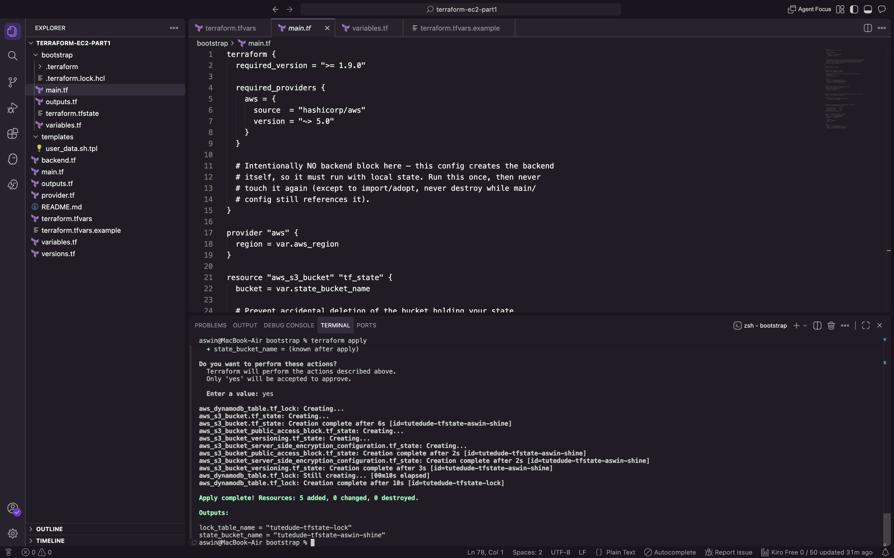
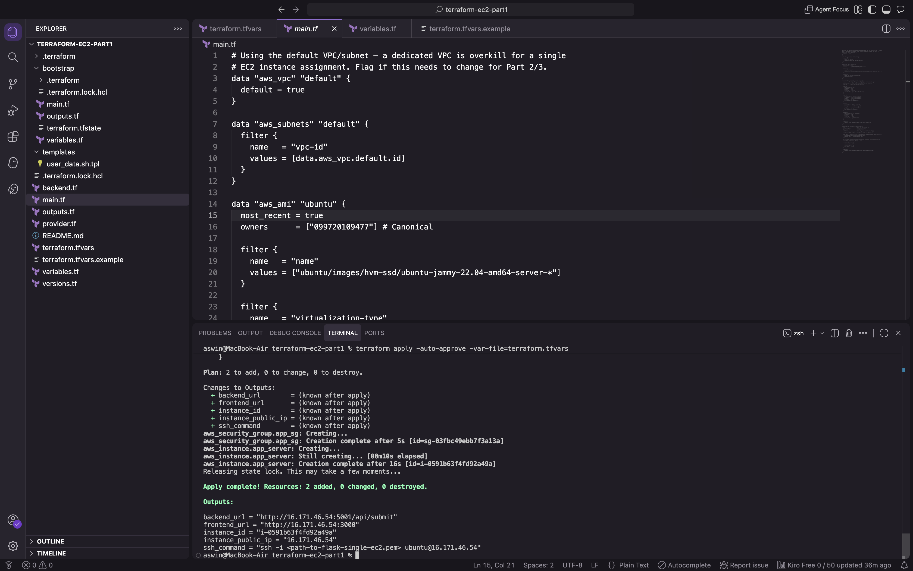
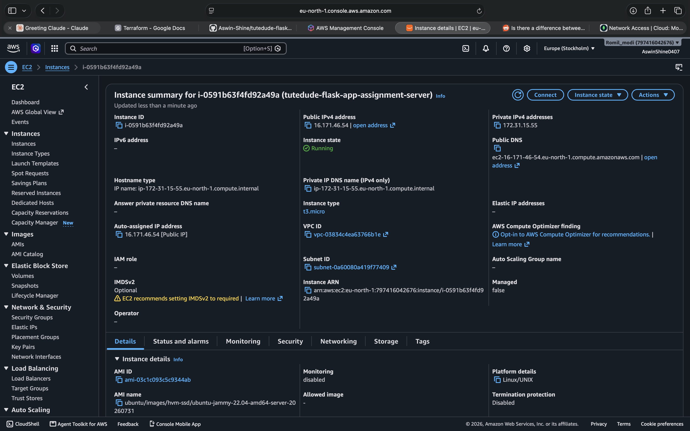
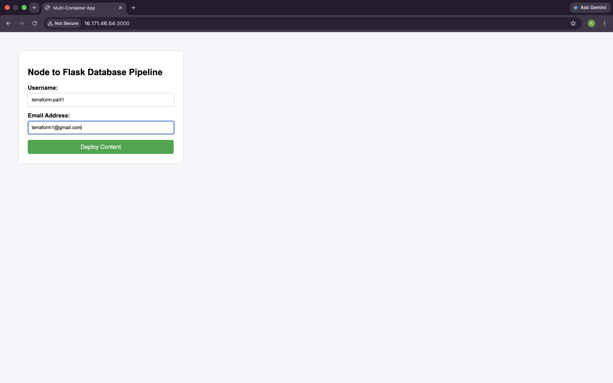
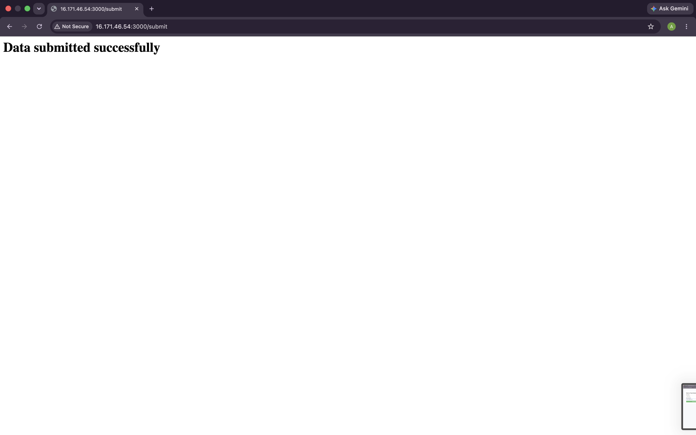

<div align="center">

# Assignment 8 : Terraform

</div>

**Task 1 : Deploy Both Flask and Express on a Single EC2 Instance**

Directory Structure
```
terraform-ec2-part1/
├── bootstrap/          ← run once: creates S3 bucket + DynamoDB lock table
├── main.tf             ← default VPC, SG (22/3000/5000), Ubuntu 22.04 EC2
├── variables.tf         backend.tf   outputs.tf   provider.tf   versions.tf
├── templates/user_data.sh.tpl  
└── README.md
```

---

Terraform Files (bootstrap)

1. Main Terraform File (main.tf)
```
terraform {
  required_version = ">= 1.9.0"

  required_providers {
    aws = {
      source  = "hashicorp/aws"
      version = "~> 5.0"
    }
  }

  # Intentionally NO backend block here — this config creates the backend
  # itself, so it must run with local state. Run this once, then never
  # touch it again (except to import/adopt, never destroy while main/
  # config still references it).
}

provider "aws" {
  region = var.aws_region
}

resource "aws_s3_bucket" "tf_state" {
  bucket = var.state_bucket_name

  # Prevent accidental deletion of the bucket holding your state
  lifecycle {
    prevent_destroy = true
  }

  tags = {
    Name    = var.state_bucket_name
    Project = "tutedude-devops-assignment"
    Purpose = "terraform-remote-state"
  }
}

resource "aws_s3_bucket_versioning" "tf_state" {
  bucket = aws_s3_bucket.tf_state.id
  versioning_configuration {
    status = "Enabled"
  }
}

resource "aws_s3_bucket_server_side_encryption_configuration" "tf_state" {
  bucket = aws_s3_bucket.tf_state.id

  rule {
    apply_server_side_encryption_by_default {
      sse_algorithm = "AES256"
    }
  }
}

resource "aws_s3_bucket_public_access_block" "tf_state" {
  bucket = aws_s3_bucket.tf_state.id

  block_public_acls       = true
  block_public_policy     = true
  ignore_public_acls      = true
  restrict_public_buckets = true
}

resource "aws_dynamodb_table" "tf_lock" {
  name         = var.lock_table_name
  billing_mode = "PAY_PER_REQUEST"
  hash_key     = "LockID"

  attribute {
    name = "LockID"
    type = "S"
  }

  tags = {
    Name    = var.lock_table_name
    Project = "tutedude-devops-assignment"
    Purpose = "terraform-state-locking"
  }
}

```

Commands to run :
```
cd /bootstrap
terrform init
terraform plan 
terraform apply
```

**Explanation**
- Local Bootstrap Execution: Runs locally without a remote backend block to provision the underlying AWS infrastructure needed to host remote Terraform state files.

- Protected S3 State Storage: Provisions an S3 bucket configured with prevent_destroy = true to store state files safely and prevent accidental deletion.

- State Security & Recovery: Enforces AES256 server-side encryption, enables bucket versioning for state rollback/history, and blocks all public access.

- DynamoDB State Locking: Creates a PAY_PER_REQUEST DynamoDB table with a LockID primary key to lock state files during runs and prevent concurrent execution conflicts.



---

Terraform Files (root folder)

1. Terraform Vars File (terraform.tfvars)
```
aws_region       = "eu-north-1"
environment      = "assignment"
project_name     = "tutedude-flask-app"
instance_type    = "t3.micro"
key_name         = "flask-single-ec2"  # must already exist in eu-north-1
allowed_ssh_cidr = "0.0.0.0/32"            
github_repo_url  = "https://github.com/Aswin-Shine/tutedude-flask-app.git"
backend_port     = 5001
frontend_port    = 3000
# Mongo URI is not a variable here — docker-compose.yml in the repo
# already hardcodes it. Rotate the password in Atlas + repo if needed.
```

**Explanation**
- Environment & Region Targeting: Sets eu-north-1 (Stockholm) as the AWS deployment region and assigns project naming tags under the assignment environment.

- Compute & Security Parameters: Selects a t3.micro instance size, binds an existing AWS SSH key pair, and defines network CIDR constraints for SSH access.

- Repository Source Mapping: Links deployment automation directly to your GitHub monorepo (Aswin-Shine/tutedude-flask-app.git) for automated application provisioning.

- Service Networking & Secrets Scope: Explicitly configures service target ports (Frontend on 3000, Backend API on 5001) while delegating database connections to the repository's native Docker Compose setup.

2. Terraform Variables File (variables.tf)
```
variable "aws_region" {
  description = "AWS region to deploy into"
  type        = string
  default     = "eu-north-1"
}

variable "environment" {
  description = "Environment name, used in tags and resource naming"
  type        = string
  default     = "assignment"
}

variable "project_name" {
  description = "Short name used as a prefix for resource names"
  type        = string
  default     = "tutedude"
}

variable "instance_type" {
  description = "EC2 instance type"
  type        = string
  default     = "t3.micro"
}

variable "key_name" {
  description = "Name of an EXISTING EC2 key pair in this region, used for SSH access. Create it first: aws ec2 create-key-pair --key-name <name> --region eu-north-1"
  type        = string
}

variable "allowed_ssh_cidr" {
  description = "CIDR block allowed to SSH into the instance. Do not leave this as 0.0.0.0/0 — set it to your own IP/32."
  type        = string
}

variable "github_repo_url" {
  description = "HTTPS URL of the public GitHub repo containing the Flask + Express app"
  type        = string
  default     = "https://github.com/Aswin-Shine/tutedude-flask-app.git"
}

variable "backend_port" {
  description = "Port the Flask backend listens on"
  type        = number
  default     = 5001
}

variable "frontend_port" {
  description = "Port the Express frontend listens on"
  type        = number
  default     = 3000
}

```

**Explanation**
- Infrastructure Configuration Defaults: Establishes type-checked variable declarations for AWS deployment region (eu-north-1), project metadata, and default EC2 sizing (t3.micro).

- SSH Access Control: Demands an existing regional EC2 key pair name and enforces specific CIDR block inputs (allowed_ssh_cidr) to restrict public management access.

- Source Application Mapping: Points by default to your public GitHub repository (Aswin-Shine/tutedude-flask-app.git) for provisioning application workloads.

- Service Networking Declarations: Configures strongly typed port definitions for Express (3000) and Flask (5001) to map security group ingress rules cleanly.


3. Main Terraform File (main.tf)
```
# Using the default VPC/subnet — a dedicated VPC is overkill for a single
# EC2 instance assignment. Flag if this needs to change for Part 2/3.
data "aws_vpc" "default" {
  default = true
}

data "aws_subnets" "default" {
  filter {
    name   = "vpc-id"
    values = [data.aws_vpc.default.id]
  }
}

data "aws_ami" "ubuntu" {
  most_recent = true
  owners      = ["099720109477"] # Canonical

  filter {
    name   = "name"
    values = ["ubuntu/images/hvm-ssd/ubuntu-jammy-22.04-amd64-server-*"]
  }

  filter {
    name   = "virtualization-type"
    values = ["hvm"]
  }
}

resource "aws_security_group" "app_sg" {
  name        = "${var.project_name}-${var.environment}-sg"
  description = "Allow SSH, Flask, and Express traffic"
  vpc_id      = data.aws_vpc.default.id

  ingress {
    description = "SSH"
    from_port   = 22
    to_port     = 22
    protocol    = "tcp"
    cidr_blocks = [var.allowed_ssh_cidr]
  }

  ingress {
    description = "Express frontend"
    from_port   = var.frontend_port
    to_port     = var.frontend_port
    protocol    = "tcp"
    cidr_blocks = ["0.0.0.0/0"]
  }

  ingress {
    description = "Flask backend"
    from_port   = var.backend_port
    to_port     = var.backend_port
    protocol    = "tcp"
    cidr_blocks = ["0.0.0.0/0"]
  }

  egress {
    description = "All outbound"
    from_port   = 0
    to_port     = 0
    protocol    = "-1"
    cidr_blocks = ["0.0.0.0/0"]
  }

  tags = {
    Name = "${var.project_name}-${var.environment}-sg"
  }
}

resource "aws_instance" "app_server" {
  ami                    = data.aws_ami.ubuntu.id
  instance_type          = var.instance_type
  key_name               = var.key_name
  subnet_id              = data.aws_subnets.default.ids[0]
  vpc_security_group_ids = [aws_security_group.app_sg.id]

  user_data = templatefile("${path.module}/templates/user_data.sh.tpl", {
    github_repo_url = var.github_repo_url
    backend_port    = var.backend_port
  })

  # user_data changes should replace the instance, not silently no-op
  user_data_replace_on_change = true

  root_block_device {
    volume_size = 15
    volume_type = "gp3"
    encrypted   = true
  }

  tags = {
    Name = "${var.project_name}-${var.environment}-server"
  }
}

```

**Explanation**
- Dynamic Infrastructure Lookups: Automatically retrieves the default AWS VPC, associated subnets, and latest Ubuntu 22.04 LTS AMI to avoid hardcoded resource IDs.

- Network Security Configuration: Creates a Security Group opening restricted SSH access along with public ingress for both Express (var.frontend_port) and Flask (var.backend_port).
- Encrypted Compute Provisioning: Launches an EC2 instance inside the default subnet attached to an encrypted 15GB gp3 root EBS storage volume.

- Automated Bootstrap Lifecycle: Injects a parameterized user_data.sh.tpl startup script and enforces user_data_replace_on_change = true to force instance replacement whenever boot logic updates.

4. Outputs Terraform File (outputs.tf)
```
output "instance_id" {
  description = "EC2 instance ID"
  value       = aws_instance.app_server.id
}

output "instance_public_ip" {
  description = "Public IP of the EC2 instance"
  value       = aws_instance.app_server.public_ip
}

output "frontend_url" {
  description = "URL to access the Express frontend"
  value       = "http://${aws_instance.app_server.public_ip}:${var.frontend_port}"
}

output "backend_url" {
  description = "URL to access the Flask backend API endpoint"
  value       = "http://${aws_instance.app_server.public_ip}:${var.backend_port}/api/submit"
}

output "ssh_command" {
  description = "Command to SSH into the instance"
  value       = "ssh -i <path-to-${var.key_name}.pem> ubuntu@${aws_instance.app_server.public_ip}"
}

```

**Explanation**
- Instance Identification & Access Details: Returns the EC2 instance ID and public IP address for tracking and remote management.

- Service Endpoint Exposure: Constructs ready-to-use HTTP URLs for accessing the Express frontend (port 3000) and the Flask REST API endpoint (port 5001).

- Connection Guidance: Generates a pre-formatted SSH command template referencing your specific key pair name for immediate terminal access.

- Post-Apply Transparency: Exposes key runtime metadata in stdout upon execution completion without needing manual AWS Console lookups.

Commands to run :
```
cd ..
terraform init
terraform plan
terraform apply -auto-approve -var-file=terraform.tfvars
```




---

<div align="center">

## How to Implement

</div>

Step 1 : Start minikube
```
minikube start 
minikube status
```

Step 2 : Deploy all manifest files
```
kubectl apply -f ./k8s/backend-deployment.yaml
kubectl apply -f ./k8s/backend-service.yaml
kubectl apply -f ./k8s/frontend-deployment.yaml
kubectl apply -f ./k8s/frontend-service.yaml
```

Step 4 : Check all pods are running 
```
kubectl get pods 
kubectl get svc 
```


Step 5 : Access the application 
```
minikube service frontend-service --url
```

---

<div align="center">

## Project Screenshots

</div>

### Part 1 




